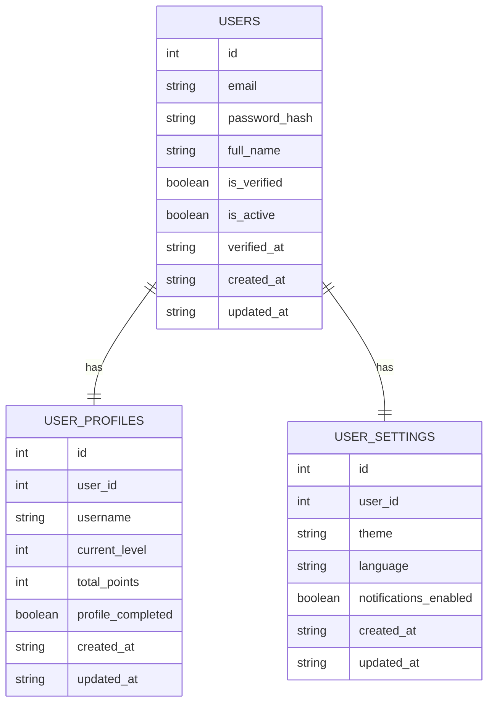

# User Authentication - Database Design

**Scope**: User Registration / Login Feature (G01_F01)  
**Tables**: 3 tables  
**Token Strategy**: Single JWT token (stateless, 7-day expiry)  
**Last Updated**: 2026-05-04

---

## 📊 Database Relationship Diagram



---

## 🗄️ Table Definitions

### USERS
```
id              INT          PRIMARY KEY                    -- Unique user identifier
email           VARCHAR(255) UNIQUE NOT NULL               -- User email (login credential)
password_hash   VARCHAR(255) NOT NULL                      -- Bcrypt hashed password
full_name       VARCHAR(100) NULL                          -- User's full name
is_verified     BOOLEAN      DEFAULT FALSE                 -- Email verified status
is_active       BOOLEAN      DEFAULT TRUE                  -- Account active status
verified_at     TIMESTAMP    NULL                          -- Email verification timestamp
created_at      TIMESTAMP    DEFAULT NOW()                 -- Account creation timestamp
updated_at      TIMESTAMP    DEFAULT NOW()                 -- Last update timestamp
```

### USER_PROFILES
```
id                INT          PRIMARY KEY                 -- Unique profile identifier
user_id           INT          UNIQUE FK → users.id        -- Foreign key to users
username          VARCHAR(30)  UNIQUE NOT NULL             -- Game username (public display)
current_level     INT          DEFAULT 1                   -- Current game level
total_points      INT          DEFAULT 0                   -- Accumulated points
profile_completed BOOLEAN      DEFAULT FALSE               -- Profile setup completion status
created_at        TIMESTAMP    DEFAULT NOW()               -- Profile creation timestamp
updated_at        TIMESTAMP    DEFAULT NOW()               -- Last profile update timestamp
```

### USER_SETTINGS
```
id                     INT         PRIMARY KEY             -- Unique settings identifier
user_id                INT         UNIQUE FK → users.id    -- Foreign key to users
theme                  VARCHAR(20) DEFAULT 'auto'          -- UI theme: 'auto', 'light', 'dark'
language               VARCHAR(10) DEFAULT 'en'            -- Language preference: 'en', 'vi', etc.
notifications_enabled  BOOLEAN     DEFAULT TRUE            -- Enable/disable notifications
created_at             TIMESTAMP   DEFAULT NOW()           -- Settings creation timestamp
updated_at             TIMESTAMP   DEFAULT NOW()           -- Last settings update timestamp
```

---

## 🔑 Indexes

```sql
-- USERS
CREATE UNIQUE INDEX idx_users_email ON users(LOWER(email));
CREATE INDEX idx_users_is_verified ON users(is_verified);

-- USER_PROFILES
CREATE UNIQUE INDEX idx_user_profiles_user_id ON user_profiles(user_id);
CREATE UNIQUE INDEX idx_user_profiles_username ON user_profiles(LOWER(username));

-- USER_SETTINGS
CREATE UNIQUE INDEX idx_user_settings_user_id ON user_settings(user_id);
```
