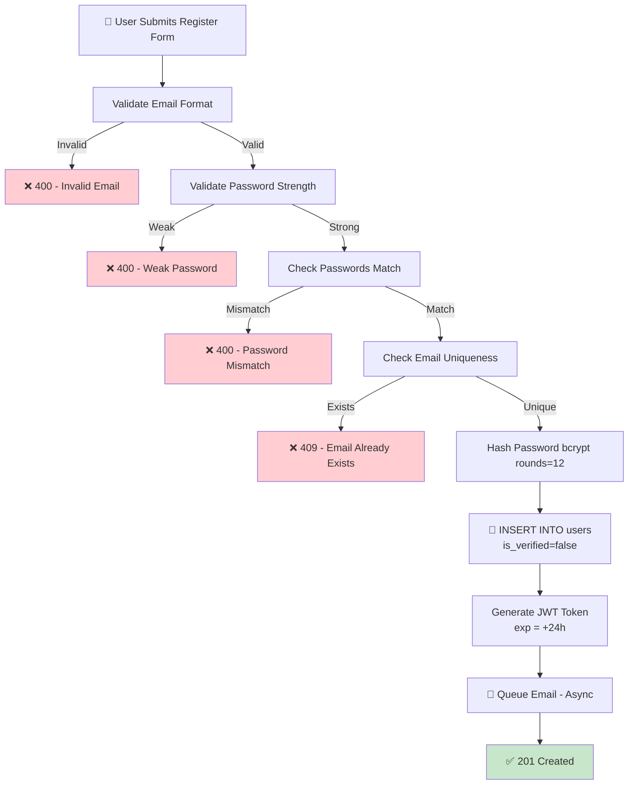

## 📝 Change History
| Date | Version | Changes | Status |
|------|---------|---------|--------|
| 2026-05-05 | 2.0.0 | Implementation complete - cleanup documentation | ✅ Complete |
| 2026-05-04 | 1.1.0 | Simplified token strategy: Single JWT (stateless) | ✅ Updated |
| 2026-05-04 | 1.0.0 | Initial creation | ✅ Complete |

# G01_F01_SF01: Register With Email

✅ MVP  
**Function**: User Registration / Login (G01_F01)  
**Status**: ✅ COMPLETE (Implemented & Tested)  
**Priority**: High (Phase 1)  
**Difficulty**: Medium  

---

## 📋 Description

Create new user account with email and password. Validate password strength, hash securely, and send email verification link. Account remains unverified until email confirmation.

---

## 🎯 Detailed Requirements

### Input Parameters

**Request Body (JSON)**
```json
{
  "email": "user@example.com",
  "password": "Secure123!",
  "confirm_password": "Secure123!",
  "full_name": "John Doe"
}
```

**Validation Rules**
- `email`: Valid email format (RFC 5322), max 255 chars, unique (case-insensitive)
- `password`: Min 8 chars, must contain uppercase, lowercase, number, special char (!@#$%^&*)
- `confirm_password`: Must match password exactly
- `full_name`: Optional, max 100 chars

### Output Schemas

**Success Response (201 Created)**
```json
{
  "success": true,
  "data": {
    "user_id": 1,
    "email": "user@example.com",
    "full_name": "John Doe",
    "message": "Account created successfully. Confirmation email sent."
  },
  "error": null
}
```

**Error Responses**
```json
{
  "success": false,
  "data": null,
  "error": {
    "code": "INVALID_EMAIL_FORMAT",
    "message": "Email must be valid format"
  }
}
```

Error codes: `INVALID_EMAIL_FORMAT` (400), `EMAIL_ALREADY_EXISTS` (409), `WEAK_PASSWORD` (400), `PASSWORD_MISMATCH` (400)

---

## 🗏️ Business Logic (10 Steps)

1. **Validate Email Format** - Check RFC 5322 format, max 255 chars → Return 400 if invalid
2. **Check Email Uniqueness** - Query database case-insensitively → Return 409 if exists
3. **Validate Password Strength** - Check 8+ chars, uppercase, lowercase, digit, special char → Return 400 if weak
4. **Verify Password Match** - Compare password === confirm_password → Return 400 if mismatch
5. **Hash Password Using Bcrypt** - Use bcrypt with cost factor=12, generate salt
6. **Create User Record** - INSERT into users table with is_verified=false, created_at=NOW()
7. **Generate Email Verification Token** - Create JWT with user_id, email, token_type="email_verification", exp=+24h (stateless, not stored in DB)
8. **Send Verification Email** - Queue email task asynchronously with verification link (currently logging only, SendGrid pending)
9. **Apply Rate Limiting** - Check registrations per IP in last 15 minutes, limit=5 (Redis-based, TODO)
10. **Return Success Response** - HTTP 201 with user_id, email, confirmation message

---

## 🔄 Flow Diagram



---

## 💻 Backend Implementation

**Status**: ✅ COMPLETE  
**Location**: `/app/schemas/auth.py`, `/app/services/auth_service.py`, `/app/api/v1/auth.py`  
**Tests**: 17/17 passing

### Architecture Overview

| Component | Purpose | Details |
|-----------|---------|---------|
| **Pydantic Schemas** | Input/output validation | Email format, password strength (5 requirements), length limits |
| **Service Layer** | Business logic | 10-step registration process, database operations |
| **API Router** | HTTP endpoint | POST `/api/v1/auth/register` returns 201 (success) or 400/409/422/500 (errors) |
| **Security Utils** | Password & tokens | Bcrypt hashing (rounds=12), JWT generation (24h expiry, HS256) |
| **Database Models** | Data persistence | User table only (stateless JWT tokens, no token storage) |

### Implementation Highlights

✅ **Request validation**: Pydantic schema validates email format, password strength, field lengths  
✅ **Case-insensitive email**: Stores as lowercase, checks uniqueness case-insensitively  
✅ **Bcrypt hashing**: Cost factor 12, never exposed in responses  
✅ **JWT tokens**: Stateless (not stored in DB), 24h expiry, includes user_id + email  
✅ **Async operations**: All database operations async/await, email queued asynchronously  
✅ **Error handling**: Proper HTTP status codes (201/400/409/422/500), consistent response format  
✅ **Security logging**: All registration attempts logged (email, IP), sensitive data excluded  

### Future Enhancements

- **Rate limiting**: Redis-based, 5 registrations per 15 minutes per IP
- **Email service**: SendGrid integration (currently logging only)
- **Email blacklist**: Disposable domain detection
- **DNS validation**: Email domain verification

---

## 📊 Security Considerations

| Area | Implementation |
|------|----------------|
| **Password Storage** | Bcrypt cost=12, never logged/returned, constant-time comparison |
| **Email Validation** | RFC 5322 format, max 255 chars, case-insensitive uniqueness |
| **Token Security** | JWT HS256, includes user_id+email, 24h expiry, stateless design |
| **Input Sanitization** | Field length validation, type validation, leading/trailing whitespace trimming |
| **Error Messages** | Generic client responses, detailed server logging, no database error exposure |
| **Rate Limiting** | Per-IP tracking with Redis, 5/15min limit, 429 Too Many Requests response |

---

## ✅ Test Coverage (17 Tests Passing)

### Success Cases (5)
- ✅ `test_register_success` - Full registration with all fields
- ✅ `test_register_without_full_name` - Optional full_name field
- ✅ `test_register_case_insensitive_email_duplicate` - Email case-insensitive check
- ✅ `test_register_duplicate_email` - Duplicate email detection
- ✅ `test_register_response_no_password_in_response` - Password never returned

### Validation Error Cases (12)
- ✅ `test_register_invalid_email_format` - Invalid email format → 400
- ✅ `test_register_email_max_length` - Email exceeds 255 chars → 422
- ✅ `test_register_weak_password_too_short` - Password < 8 chars → 422
- ✅ `test_register_weak_password_no_uppercase` - Missing uppercase → 400
- ✅ `test_register_weak_password_no_lowercase` - Missing lowercase → 400
- ✅ `test_register_weak_password_no_digit` - Missing digit → 400
- ✅ `test_register_weak_password_no_special_char` - Missing special char → 400
- ✅ `test_register_password_mismatch` - Passwords don't match → 400
- ✅ `test_register_full_name_max_length` - Full_name exceeds 100 chars → 422
- ✅ `test_register_missing_email` - Missing required field → 422
- ✅ `test_register_missing_password` - Missing required field → 422
- ✅ `test_register_missing_confirm_password` - Missing required field → 422

### Status Codes Verified
- 201 Created: Successful registration
- 400 Bad Request: Weak password, password mismatch, validation failures
- 409 Conflict: Duplicate email
- 422 Unprocessable Entity: Pydantic validation errors (wrong types, length violations)
- 500 Internal Server Error: Database/system errors

---

## 🚀 API Endpoint

**POST** `/api/v1/auth/register`

**Request Headers**
```
Content-Type: application/json
```

**Request Body**
```json
{
  "email": "user@example.com",
  "password": "SecurePass123!",
  "confirm_password": "SecurePass123!",
  "full_name": "John Doe"  // optional
}
```

**Response Examples**

✅ **Success (201)**
```json
{
  "success": true,
  "data": {
    "user_id": 1,
    "email": "user@example.com",
    "full_name": "John Doe",
    "message": "Account created successfully. Confirmation email sent."
  },
  "error": null
}
```

❌ **Invalid Email (400)**
```json
{
  "success": false,
  "data": null,
  "error": {
    "code": "INVALID_EMAIL_FORMAT",
    "message": "Invalid email format"
  }
}
```

❌ **Duplicate Email (409)**
```json
{
  "success": false,
  "data": null,
  "error": {
    "code": "EMAIL_ALREADY_EXISTS",
    "message": "Email already registered"
  }
}
```

---

## 📋 Implementation Checklist

- [x] Pydantic schemas with email & password validation
- [x] Service layer with 10-step business logic
- [x] FastAPI router with POST endpoint
- [x] SQLAlchemy User model with relationships
- [x] Bcrypt password hashing (cost=12)
- [x] JWT token generation (24h expiry, HS256)
- [x] Email verification token model
- [x] Async database operations
- [x] Error handling with proper HTTP status codes
- [x] Request/response logging
- [x] 17 comprehensive test cases
- [x] Case-insensitive email uniqueness
- [x] Password strength validation (5 requirements)
- [x] No password leaks in responses
- [x] Async email queuing (logging placeholder)

---

## 🔗 Related Documentation

- **Database Models**: `app/models/user.py`, `app/models/auth.py`
- **Test Suite**: `tests/test_auth.py` (17 tests, 100% passing)
- **API Router**: `app/api/v1/auth.py`
- **Service Logic**: `app/services/auth_service.py`
- **Security Utils**: `app/utils/security.py`

---

**Last Updated**: 2026-05-05  
**Implementation Status**: ✅ COMPLETE  
**Test Status**: ✅ 17/17 PASSING
