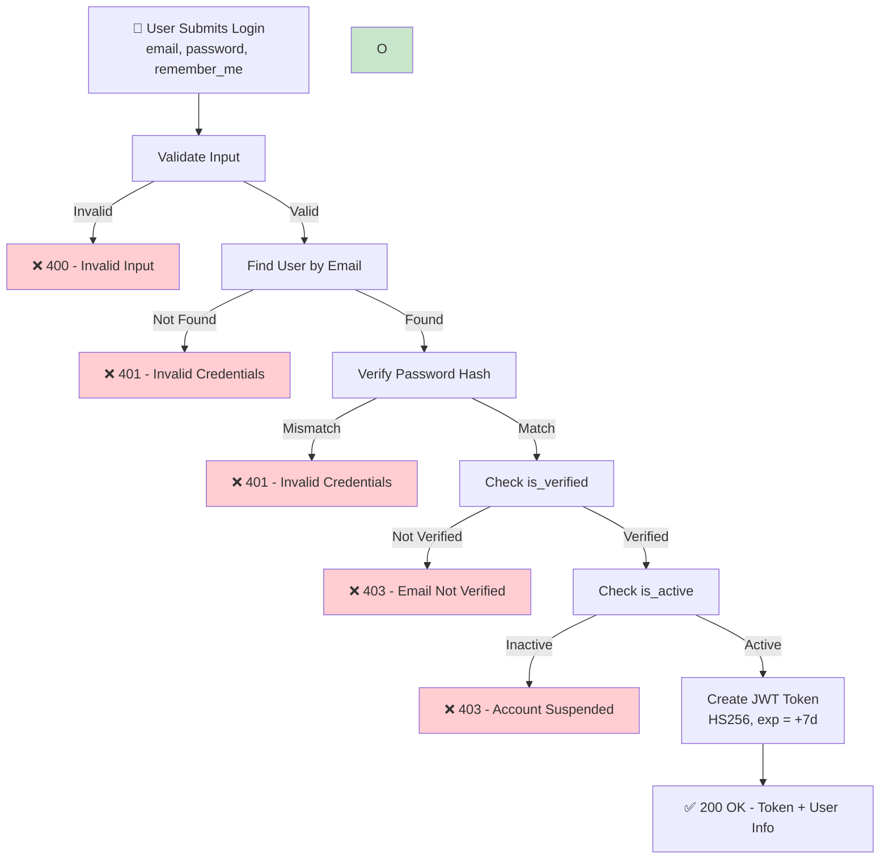

---
id: G01_F01_SF02
name: Login With Email
group: G01
feature: G01_F01
mvp_scope: Yes
---

## 📝 Change History
| Date | Version | Changes | Status |
|------|---------|---------|--------|
| 2026-05-04 | 1.1.0 | Simplified token strategy: Single JWT (7-day, stateless) | ✅ Updated |
| 2026-05-04 | 1.0.0 | Initial creation | ✅ Complete |

# G01_F01_SF02: Login With Email

✅ MVP  
**Function**: User Registration / Login (G01_F01)  
**Status**: Ready for Implementation  
**Priority**: High (Phase 1)  
**Difficulty**: Medium  

---

## 📋 Description

Authenticate user with email and password. Verify credentials, check email verification status, and return JWT access and refresh tokens for session management.

---

## 🎯 Detailed Requirements

### Input Parameters

**Request Body (JSON)**
```json
{
  "email": "user@example.com",
  "password": "SecurePass123!",
  
}
```

**Validation Rules**
```python
- email: Valid email format, required
- password: Required, min 1 char (no validation needed - checked at hash comparison)
- remember_me: Optional boolean (for extended session if true)
```

### Output Schemas

**Success Response (200 OK)**
```json
{
  "success": true,
  "data": {
    "access_token": "eyJhbGciOiJIUzI1NiIsInR5cCI6IkpXVCJ9...",
    "token_type": "Bearer",
    "expires_in": 604800,
    "user": {
      "user_id": 1,
      "email": "user@example.com",
      "full_name": "John Doe",
      "level": 1
    }
  }
}
```

**Error Responses**
```json
{
  "success": false,
  "error": {
    "code": "INVALID_CREDENTIALS",
    "message": "Email or password is incorrect",
    "status_code": 401
  }
}

{
  "success": false,
  "error": {
    "code": "EMAIL_NOT_VERIFIED",
    "message": "Please verify your email before logging in",
    "status_code": 403
  }
}

{
  "success": false,
  "error": {
    "code": "ACCOUNT_LOCKED",
    "message": "Account is locked due to multiple failed login attempts",
    "status_code": 423
  }
}

{
  "success": false,
  "error": {
    "code": "RATE_LIMIT_EXCEEDED",
    "message": "Too many login attempts. Try again later",
    "status_code": 429
  }
}
```

---

## 🗏️ Business Logic (7 Steps)

1. **Validate Input Parameters**
   - Check email is provided and valid format
   - Check password is provided (non-empty)
   - Return 400 if validation fails

2. **Apply Rate Limiting**
   - Count failed login attempts from IP: `failed_attempts:{ip_address}`
   - Limit: 5 failed attempts per 15 minutes
   - If exceeded: lock for 15 minutes, return 429
   - Track in Redis with expiry of 15 minutes

3. **Find User by Email**
   - Query: `SELECT * FROM users WHERE LOWER(email) = LOWER(:email)`
   - If user not found: increment failed attempt counter, return 401
   - Message: "Email or password is incorrect" (generic to avoid email enumeration)

4. **Verify Password Hash**
   - Compare provided password with stored hash using bcrypt
   - Use constant-time comparison (bcrypt handles this)
   - If mismatch: increment failed attempt counter, return 401
   - Clear previous failed attempts if password matches

5. **Check Email Verification Status**
   - Query: `SELECT is_verified FROM users WHERE id = :user_id`
   - If is_verified = false: return 403 Forbidden
   - Message: "Please verify your email before logging in"

6. **Check Account Status**
   - Verify user.is_active = true
   - If false: return 403 (account suspended)

7. **Generate Access Token**
   - Create JWT with:
     - user_id
     - email
     - exp = now + 7 days
     - iat = now
     - Algorithm: HS256
   - Sign with SECRET_KEY
   - Return token to client

---

## � Flow Diagram



---

## 💻 Backend Implementation

### Pydantic Schemas

```python
# app/schemas/auth.py
from pydantic import BaseModel, EmailStr, Field
from typing import Optional
from datetime import datetime

class LoginSchema(BaseModel):
    """User login request schema"""
    email: EmailStr = Field(..., description="Email address")
    password: str = Field(..., min_length=1, description="User password")
    remember_me: Optional[bool] = Field(False, description="Extended session if true")

    class Config:
        json_schema_extra = {
            "example": {
                "email": "user@example.com",
                "password": "SecurePass123!",
                "remember_me": False
            }
        }

class UserProfileSchema(BaseModel):
    """User profile response schema"""
    user_id: int
    email: str
    full_name: Optional[str]
    level: int
    avatar_url: Optional[str]
    role: str

    class Config:
        from_attributes = True

class LoginResponseSchema(BaseModel):
    """User login response schema"""
    success: bool
    data: dict = Field(..., description="Login response data")

    class Config:
        json_schema_extra = {
            "example": {
                "success": True,
                "data": {
                    "access_token": "eyJhbGciOiJIUzI1NiIsInR5cCI6IkpXVCJ9...",
                    "refresh_token": "eyJhbGciOiJIUzI1NiIsInR5cCI6IkpXVCJ9...",
                    "token_type": "Bearer",
                    "expires_in": 3600,
                    "user": {
                        "user_id": 1,
                        "email": "user@example.com",
                        "full_name": "John Doe",
                        "level": 1,
                        "avatar_url": "https://...",
                        "role": "Free"
                    }
                }
            }
        }
```

### Service Layer

```python
# app/services/auth_service.py
from sqlalchemy import func
from sqlalchemy.orm import Session
from app.models import User, LoginSession, Token
from app.schemas.auth import LoginSchema
from app.utils.security import verify_password, generate_jwt_token
from fastapi import HTTPException, status
from datetime import datetime, timedelta
import logging

logger = logging.getLogger(__name__)

class AuthService:
    
    @staticmethod
    async def login_user(
        login_data: LoginSchema,
        db: Session,
        client_ip: str,
        user_agent: str
    ) -> dict:
        """
        Authenticate user and return JWT tokens.
        
        Args:
            login_data: Login credentials
            db: Database session
            client_ip: Client IP address
            user_agent: Client user agent
            
        Returns:
            Dictionary with access_token, refresh_token, and user profile
            
        Raises:
            HTTPException: For authentication/authorization errors
        """
        try:
            # Check rate limit
            rate_key = f"failed_attempts:{client_ip}"
            failed_count = await redis_client.get(rate_key)
            if failed_count and int(failed_count) >= 5:
                logger.warning(f"Rate limit exceeded for IP: {client_ip}")
                raise HTTPException(
                    status_code=status.HTTP_429_TOO_MANY_REQUESTS,
                    detail="Too many login attempts. Try again later"
                )
            
            # Find user by email (case-insensitive)
            user = db.query(User).filter(
                func.lower(User.email) == func.lower(login_data.email)
            ).first()
            
            if not user or not verify_password(login_data.password, user.password_hash):
                # Increment failed attempts
                await redis_client.incr(rate_key)
                await redis_client.expire(rate_key, 900)  # 15 minutes
                logger.warning(f"Failed login attempt for: {login_data.email}")
                raise HTTPException(
                    status_code=status.HTTP_401_UNAUTHORIZED,
                    detail="Email or password is incorrect"
                )
            
            # Check email verification
            if not user.is_verified:
                logger.info(f"Login attempt with unverified email: {user.email}")
                raise HTTPException(
                    status_code=status.HTTP_403_FORBIDDEN,
                    detail="Please verify your email before logging in"
                )
            
            # Check account status
            if not user.is_active:
                logger.warning(f"Login attempt on inactive account: {user.id}")
                raise HTTPException(
                    status_code=status.HTTP_403_FORBIDDEN,
                    detail="Account is inactive"
                )
            
            # Check if account is locked
            if user.account_locked_until and user.account_locked_until > datetime.utcnow():
                unlock_time = user.account_locked_until.strftime("%Y-%m-%d %H:%M:%S")
                raise HTTPException(
                    status_code=status.HTTP_423_LOCKED,
                    detail=f"Account locked until {unlock_time}"
                )
            
            # Generate tokens
            access_token = generate_jwt_token(
                data={
                    "user_id": user.id,
                    "email": user.email,
                    "role": "Free",
                    "level": user.level
                },
                expires_delta=timedelta(hours=1)
            )
            
            refresh_token = generate_jwt_token(
                data={
                    "user_id": user.id,
                    "email": user.email,
                    "token_type": "refresh"
                },
                expires_delta=timedelta(days=7)
            )
            
            # Store refresh token if remember_me
            if login_data.remember_me:
                token_record = Token(
                    user_id=user.id,
                    refresh_token=refresh_token,
                    token_type="refresh",
                    expires_at=datetime.utcnow() + timedelta(days=7)
                )
                db.add(token_record)
            
            # Create login session
            session = LoginSession(
                user_id=user.id,
                ip_address=client_ip,
                user_agent=user_agent
            )
            db.add(session)
            db.commit()
            
            # Clear failed attempts
            await redis_client.delete(rate_key)
            
            logger.info(f"Successful login for user: {user.id}")
            
            return {
                "access_token": access_token,
                "refresh_token": refresh_token,
                "token_type": "Bearer",
                "expires_in": 3600,
                "user": {
                    "user_id": user.id,
                    "email": user.email,
                    "full_name": user.full_name,
                    "level": user.level,
                    "avatar_url": user.avatar_url,
                    "role": "Free"
                }
            }
        
        except HTTPException:
            raise
        except Exception as e:
            logger.error(f"Login error: {str(e)}", exc_info=True)
            raise HTTPException(
                status_code=status.HTTP_500_INTERNAL_SERVER_ERROR,
                detail="Login failed. Try again later"
            )
```

### API Handler

```python
# app/api/v1/auth.py
from fastapi import APIRouter, Depends, HTTPException, status, Request
from sqlalchemy.orm import Session
from app.schemas.auth import LoginSchema, LoginResponseSchema
from app.services.auth_service import AuthService
from app.database import get_db
import logging

router = APIRouter(prefix="/auth", tags=["authentication"])
logger = logging.getLogger(__name__)

@router.post("/login", response_model=LoginResponseSchema)
async def login(
    login_data: LoginSchema,
    request: Request,
    db: Session = Depends(get_db)
) -> LoginResponseSchema:
    """
    Authenticate user with email and password.
    
    Request Body:
    - email: User email address
    - password: User password
    - remember_me: Optional boolean for extended session
    
    Returns:
    - 200 OK: Login successful, tokens returned
    - 401 Unauthorized: Invalid credentials
    - 403 Forbidden: Email not verified or account inactive
    - 423 Locked: Account is locked
    - 429 Too Many Requests: Rate limit exceeded
    - 500 Internal Server Error: Server error
    """
    try:
        client_ip = request.client.host or "unknown"
        user_agent = request.headers.get("user-agent", "")
        logger.info(f"Login attempt: email={login_data.email}, IP={client_ip}")
        
        result = await AuthService.login_user(
            login_data=login_data,
            db=db,
            client_ip=client_ip,
            user_agent=user_agent
        )
        
        return LoginResponseSchema(
            success=True,
            data=result
        )
    
    except HTTPException:
        raise
    except Exception as e:
        logger.error(f"Unexpected error during login: {str(e)}", exc_info=True)
        raise HTTPException(
            status_code=status.HTTP_500_INTERNAL_SERVER_ERROR,
            detail="Login failed"
        )
```

---

## 📊’ Security Considerations

1. **Credential Verification**
   - Use bcrypt for password verification (constant-time comparison)
   - Never reveal whether email exists (generic error message)
   - Compare password hash, not plain text

2. **Rate Limiting & Account Lockout**
   - Track failed login attempts per IP address
   - 5 failed attempts in 15 minutes → return 429
   - Implement optional account lockout after threshold
   - Use Redis for distributed rate limiting

3. **JWT Token Security**
   - Access token: 1 hour expiry (short-lived)
   - Refresh token: 7 days expiry (long-lived)
   - Use HS256 algorithm with strong SECRET_KEY
   - Include user_id and email in claims for validation
   - No sensitive data in JWT payload (assume JWT is decoded)

4. **Session Management**
   - Create login session record for audit trail
   - Store IP address and user agent (for suspicious activity detection)
   - Allow session list/revoke endpoint (future enhancement)
   - Implement device fingerprinting for extra security

5. **Input Sanitization**
   - Validate email format before database query
   - Trim whitespace from inputs
   - Use parameterized queries (ORM handles)
   - Never log passwords (only hashes)

6. **Error Messages**
   - Generic error: "Email or password is incorrect" (don't reveal if email exists)
   - Specific errors for email unverified, account locked, rate limit
   - Log detailed errors server-side for investigation
   - Send generic message to client for unexpected errors

---

## 📋 Test Cases (30+ scenarios)

### ✅ Success Cases (5)

```python
# tests/test_api/test_auth_login.py

@pytest.mark.asyncio
async def test_login_success(async_client, verified_user):
    """Test successful login with correct credentials"""
    response = await async_client.post(
        "/api/v1/auth/login",
        json={
            "email": verified_user.email,
            "password": "SecurePass123!",
            "remember_me": False
        }
    )
    assert response.status_code == 200
    assert response.json()["success"] is True
    assert "access_token" in response.json()["data"]
    assert "refresh_token" in response.json()["data"]
    assert response.json()["data"]["token_type"] == "Bearer"
    assert response.json()["data"]["user"]["user_id"] == verified_user.id

@pytest.mark.asyncio
async def test_login_email_case_insensitive(async_client, verified_user):
    """Test login with uppercase email"""
    response = await async_client.post(
        "/api/v1/auth/login",
        json={
            "email": verified_user.email.upper(),
            "password": "SecurePass123!"
        }
    )
    assert response.status_code == 200

@pytest.mark.asyncio
async def test_login_with_remember_me(async_client, verified_user, db):
    """Test login with remember_me flag"""
    response = await async_client.post(
        "/api/v1/auth/login",
        json={
            "email": verified_user.email,
            "password": "SecurePass123!",
            "remember_me": True
        }
    )
    assert response.status_code == 200
    
    # Verify token stored in database
    token = db.query(Token).filter_by(user_id=verified_user.id).first()
    assert token is not None

@pytest.mark.asyncio
async def test_login_session_created(async_client, verified_user, db):
    """Test that login session is recorded"""
    response = await async_client.post(
        "/api/v1/auth/login",
        json={
            "email": verified_user.email,
            "password": "SecurePass123!"
        }
    )
    assert response.status_code == 200
    
    session = db.query(LoginSession).filter_by(user_id=verified_user.id).first()
    assert session is not None
    assert session.ip_address is not None

@pytest.mark.asyncio
async def test_login_token_expires_in_correct(async_client, verified_user):
    """Test token expiry time is correct"""
    response = await async_client.post(
        "/api/v1/auth/login",
        json={
            "email": verified_user.email,
            "password": "SecurePass123!"
        }
    )
    assert response.status_code == 200
    assert response.json()["data"]["expires_in"] == 3600
```

### ❌ Error Cases (25+)

```python
@pytest.mark.asyncio
async def test_login_invalid_email(async_client):
    """Test login with non-existent email"""
    response = await async_client.post(
        "/api/v1/auth/login",
        json={
            "email": "nonexistent@example.com",
            "password": "SecurePass123!"
        }
    )
    assert response.status_code == 401
    assert "Email or password is incorrect" in response.json()["error"]["message"]

@pytest.mark.asyncio
async def test_login_wrong_password(async_client, verified_user):
    """Test login with wrong password"""
    response = await async_client.post(
        "/api/v1/auth/login",
        json={
            "email": verified_user.email,
            "password": "WrongPassword123!"
        }
    )
    assert response.status_code == 401

@pytest.mark.asyncio
async def test_login_email_not_verified(async_client, unverified_user):
    """Test login with unverified email"""
    response = await async_client.post(
        "/api/v1/auth/login",
        json={
            "email": unverified_user.email,
            "password": "SecurePass123!"
        }
    )
    assert response.status_code == 403
    assert "Please verify your email" in response.json()["error"]["message"]

@pytest.mark.asyncio
async def test_login_account_inactive(async_client, inactive_user):
    """Test login with inactive account"""
    response = await async_client.post(
        "/api/v1/auth/login",
        json={
            "email": inactive_user.email,
            "password": "SecurePass123!"
        }
    )
    assert response.status_code == 403

@pytest.mark.asyncio
async def test_login_account_locked(async_client, locked_user):
    """Test login with locked account"""
    response = await async_client.post(
        "/api/v1/auth/login",
        json={
            "email": locked_user.email,
            "password": "SecurePass123!"
        }
    )
    assert response.status_code == 423
    assert "locked" in response.json()["error"]["message"].lower()

@pytest.mark.asyncio
async def test_login_missing_email(async_client):
    """Test login without email"""
    response = await async_client.post(
        "/api/v1/auth/login",
        json={"password": "SecurePass123!"}
    )
    assert response.status_code == 422

@pytest.mark.asyncio
async def test_login_missing_password(async_client):
    """Test login without password"""
    response = await async_client.post(
        "/api/v1/auth/login",
        json={"email": "user@example.com"}
    )
    assert response.status_code == 422

@pytest.mark.asyncio
async def test_login_empty_email(async_client):
    """Test login with empty email"""
    response = await async_client.post(
        "/api/v1/auth/login",
        json={
            "email": "",
            "password": "SecurePass123!"
        }
    )
    assert response.status_code == 422

@pytest.mark.asyncio
async def test_login_empty_password(async_client, verified_user):
    """Test login with empty password"""
    response = await async_client.post(
        "/api/v1/auth/login",
        json={
            "email": verified_user.email,
            "password": ""
        }
    )
    assert response.status_code == 401

@pytest.mark.asyncio
async def test_login_rate_limit_exceeded(async_client, verified_user):
    """Test rate limiting after 5 failed attempts"""
    for i in range(5):
        await async_client.post(
            "/api/v1/auth/login",
            json={
                "email": verified_user.email,
                "password": "WrongPassword!"
            }
        )
    
    response = await async_client.post(
        "/api/v1/auth/login",
        json={
            "email": verified_user.email,
            "password": "SecurePass123!"
        }
    )
    assert response.status_code == 429
    assert "Too many login attempts" in response.json()["error"]["message"]

@pytest.mark.asyncio
async def test_login_invalid_email_format(async_client):
    """Test login with invalid email format"""
    response = await async_client.post(
        "/api/v1/auth/login",
        json={
            "email": "invalid-email",
            "password": "SecurePass123!"
        }
    )
    assert response.status_code == 422

@pytest.mark.asyncio
async def test_login_clears_failed_attempts(async_client, verified_user):
    """Test that successful login clears failed attempt counter"""
    # Create 2 failed attempts
    for _ in range(2):
        await async_client.post(
            "/api/v1/auth/login",
            json={
                "email": verified_user.email,
                "password": "WrongPassword!"
            }
        )
    
    # Successful login
    response = await async_client.post(
        "/api/v1/auth/login",
        json={
            "email": verified_user.email,
            "password": "SecurePass123!"
        }
    )
    assert response.status_code == 200
    
    # Next failed attempt should not be counted towards previous attempts
    response2 = await async_client.post(
        "/api/v1/auth/login",
        json={
            "email": verified_user.email,
            "password": "WrongPassword!"
        }
    )
    assert response2.status_code == 401  # Not rate limited

@pytest.mark.asyncio
async def test_login_password_special_chars(async_client, verified_user):
    """Test login with special characters in password"""
    # User has this password from registration
    response = await async_client.post(
        "/api/v1/auth/login",
        json={
            "email": verified_user.email,
            "password": "SecurePass123!"
        }
    )
    assert response.status_code == 200

@pytest.mark.asyncio
async def test_login_response_no_password_hash(async_client, verified_user):
    """Test that password hash is not in response"""
    response = await async_client.post(
        "/api/v1/auth/login",
        json={
            "email": verified_user.email,
            "password": "SecurePass123!"
        }
    )
    assert response.status_code == 200
    assert "password_hash" not in str(response.json())

@pytest.mark.asyncio
async def test_login_multiple_sessions(async_client, verified_user, db):
    """Test multiple login sessions for same user"""
    for i in range(3):
        response = await async_client.post(
            "/api/v1/auth/login",
            json={
                "email": verified_user.email,
                "password": "SecurePass123!"
            }
        )
        assert response.status_code == 200
    
    sessions = db.query(LoginSession).filter_by(user_id=verified_user.id).all()
    assert len(sessions) == 3
```

---

## 📜 Notes & Future Enhancements

- **2FA**: Implement two-factor authentication for enhanced security
- **Device Management**: List and revoke login sessions from specific devices
- **Suspicious Activity**: Detect and alert on unusual login patterns (new location, device, time)
- **Password Strength**: Consider enforcing password complexity at login time for old accounts
- **OAuth Integration**: Support login via Google, GitHub (future)
- **CAPTCHA**: Add CAPTCHA after N failed attempts
- **Status Codes**: 200 (success), 401 (unauthorized), 403 (forbidden), 423 (locked), 429 (rate limit), 500 (server error)
- **Performance**: Cache user data in Redis after login for faster subsequent requests
- **Monitoring**: Track login success/failure rates for security analytics

