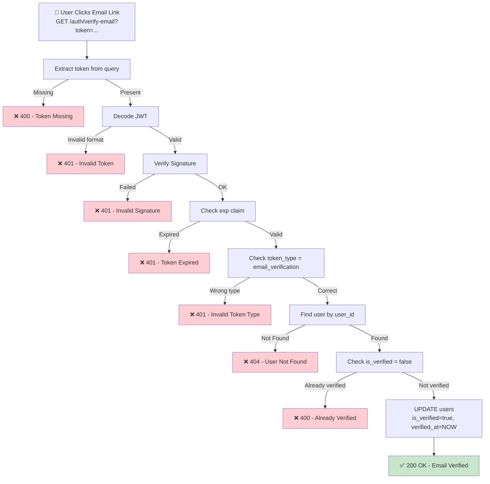

---
id: G01_F01_SF06
name: Verify Email Address
group: G01
feature: G01_F01
mvp_scope: Yes
---

## 📝 Change History
| Date | Version | Changes | Status |
|------|---------|---------|--------|
| 2026-05-04 | 1.1.0 | Simplified token strategy: Stateless JWT verification | ✅ Updated |
| 2026-05-04 | 1.0.0 | Initial creation | ✅ Complete |

# G01_F01_SF06: Verify Email Address

✅ MVP | **Authentication** | **Email Verification**

## 📋 Description

Verify user email address using token from email link. Mark user as verified and allow first login after email confirmation.

## 🎯 API Specification

**Endpoint**: `GET /api/v1/auth/verify-email?token={token}`

**Input Parameters**
```
- token: string (JWT from email link, required in query string)
```

**Output (200 OK)**
```json
{
  "success": true,
  "data": {
    "user_id": 1,
    "email": "user@example.com",
    "message": "Email verified successfully. You can now log in.",
    "verified_at": "2026-05-04T10:00:00Z"
  }
}
```

**Error Responses**
```json
{
  "success": false,
  "error": {
    "code": "INVALID_TOKEN",
    "message": "Verification token is invalid or expired",
    "status_code": 401
  }
}

{
  "success": false,
  "error": {
    "code": "EMAIL_ALREADY_VERIFIED",
    "message": "Email is already verified",
    "status_code": 400
  }
}
```

## 🗏️ Business Logic (7 Steps)

1. **Extract Token from Query Parameter**
   - Get token from URL: `?token={token}`
   - Return 400 if token missing

2. **Validate JWT Format**
   - Check token structure (JWT = header.payload.signature)
   - Return 401 if invalid format

3. **Verify Token Signature**
   - Use SECRET_KEY to verify JWT signature
   - Return 401 if verification fails

4. **Decode JWT and Extract Claims**
   - Decode JWT to get payload
   - Extract user_id, email, token_type, exp

5. **Check Token Expiry**
   - Verify exp claim: exp > NOW()
   - Return 401 if token expired

6. **Check Token Type**
   - Verify token_type = "email_verification"
   - Return 401 if different type

7. **Verify User and Update Status**
   - Query user by user_id from token
   - If not found: return 404
   - If already verified (is_verified=true): return 400
   - Update: is_verified=true, verified_at=NOW()
   - Return 200 OK

**Status Codes**: 200 (success), 400 (bad request), 401 (unauthorized), 404 (not found), 500 (server error)

---

## � Flow Diagram



## 💻 Backend Implementation

```python
# app/api/v1/auth.py
from fastapi import APIRouter, Depends, HTTPException, status, Query
from sqlalchemy.orm import Session
from app.services.auth_service import AuthService
from app.database import get_db
import logging

logger = logging.getLogger(__name__)

@router.get("/verify-email")
async def verify_email(
    token: str = Query(..., description="Verification token from email"),
    db: Session = Depends(get_db)
):
    """Verify user email with token from email link"""
    try:
        result = await AuthService.verify_email(token, db)
        return {"success": True, "data": result}
    except HTTPException:
        raise
    except Exception as e:
        logger.error(f"Email verification error: {str(e)}")
        raise HTTPException(status_code=500, detail="Verification failed")

# Service Layer
async def verify_email(token: str, db: Session) -> dict:
    """Verify email with token"""
    try:
        # Decode token
        payload = decode_jwt(token)
        user_id = payload.get("user_id")
        token_type = payload.get("token_type")
        
        if token_type != "email_verification":
            raise HTTPException(status_code=401, detail="Invalid token type")
        
        # Get token record
        token_record = db.query(EmailVerificationToken).filter(
            EmailVerificationToken.token == token,
            EmailVerificationToken.used_at == None
        ).first()
        
        if not token_record:
            raise HTTPException(status_code=401, detail="Token invalid or already used")
        
        # Get user
        user = db.query(User).filter(User.id == user_id).first()
        if not user:
            raise HTTPException(status_code=404, detail="User not found")
        
        if user.is_verified:
            raise HTTPException(status_code=400, detail="Email already verified")
        
        # Mark as verified
        user.is_verified = True
        user.verified_at = datetime.utcnow()
        token_record.used_at = datetime.utcnow()
        db.commit()
        
        logger.info(f"Email verified for user: {user_id}")
        
        return {
            "user_id": user.id,
            "email": user.email,
            "message": "Email verified successfully. You can now log in.",
            "verified_at": user.verified_at.isoformat()
        }
    except HTTPException:
        raise
    except Exception as e:
        logger.error(f"Verification error: {str(e)}")
        raise HTTPException(status_code=500, detail="Verification failed")
```

---

## 📊’ Security Considerations

1. **Token Validation**: Verify signature, expiry, type
2. **Idempotency**: Allow re-verification without errors (check already verified)
3. **One-time Use**: Mark token as used to prevent reuse
4. **Rate Limiting**: Limit verification attempts
5. **XSS Protection**: Validate token format before processing

## 📋 Test Cases

```python
@pytest.mark.asyncio
async def test_verify_email_success(async_client, user_with_verification_token):
    """Test successful email verification"""
    response = await async_client.get(
        f"/api/v1/auth/verify-email?token={user_with_verification_token.token}"
    )
    assert response.status_code == 200
    assert response.json()["data"]["user_id"] == user_with_verification_token.user_id

@pytest.mark.asyncio
async def test_verify_email_invalid_token(async_client):
    """Test with invalid token"""
    response = await async_client.get("/api/v1/auth/verify-email?token=invalid")
    assert response.status_code == 401

@pytest.mark.asyncio
async def test_verify_email_expired_token(async_client, expired_token):
    """Test with expired token"""
    response = await async_client.get(f"/api/v1/auth/verify-email?token={expired_token}")
    assert response.status_code == 401

@pytest.mark.asyncio
async def test_verify_email_already_verified(async_client, verified_user):
    """Test verification for already verified user"""
    response = await async_client.get(f"/api/v1/auth/verify-email?token=sometoken")
    assert response.status_code in [400, 401]

@pytest.mark.asyncio
async def test_verify_email_missing_token(async_client):
    """Test without token parameter"""
    response = await async_client.get("/api/v1/auth/verify-email")
    assert response.status_code == 422
```

## 📜 Notes

- **Email Service**: Send verification link via email
- **Frontend**: Redirect to login page after verification
- **Resend**: Implement resend verification email endpoint
- **Cleanup**: Schedule cleanup of expired tokens (7+ days old)

