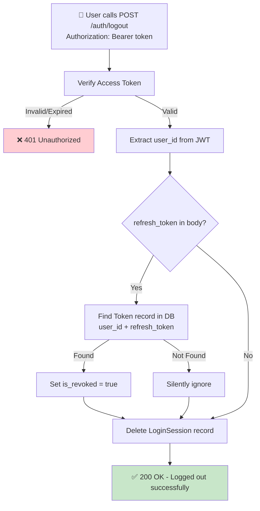

---
id: G01_F01_SF07
name: Logout
group: G01
feature: G01_F01
mvp_scope: Yes
---

## 📝 Change History
| Date | Version | Changes | Status |
|------|---------|---------|--------|
| 2026-05-09 | 1.0.0 | Initial creation | ✅ Complete |

# G01_F01_SF07: Logout

✅ MVP  
**Function**: User Registration / Login (G01_F01)  
**Status**: Ready for Implementation  
**Priority**: High (Phase 1)  
**Difficulty**: Low  

---

## 📋 Description

Log out user by revoking their refresh token (if stored with `remember_me=true`) and deleting the login session record.  
Access tokens are **stateless JWT** (7-day expiry) — they cannot be invalidated server-side, but become useless once the client discards them.

---

## 🎯 API Specification

**Endpoint**: `POST /api/v1/auth/logout`

**Headers**
```
Authorization: Bearer <access_token>
```

**Request Body (JSON)**
```json
{
  "refresh_token": "eyJhbGciOiJIUzI1NiIsInR5cCI6IkpXVCJ9..."
}
```

> `refresh_token` is optional — only needed if `remember_me=true` was used during login.

---

### Success Response (200 OK)
```json
{
  "success": true,
  "data": {
    "message": "Logged out successfully"
  },
  "error": null
}
```

### Error Responses
```json
{
  "success": false,
  "error": {
    "code": "UNAUTHORIZED",
    "message": "Invalid or expired access token",
    "status_code": 401
  }
}
```

---

## 🗏️ Business Logic (5 Steps)

1. **Verify Access Token**
   - Extract `Authorization: Bearer <token>` header
   - Decode and verify JWT signature + expiry
   - Return 401 if token is invalid or expired

2. **Extract user_id from Token**
   - Read `sub` claim from decoded payload → `user_id`

3. **Revoke Refresh Token (Optional)**
   - If `refresh_token` provided in body:
     - Find Token record: `WHERE refresh_token = :refresh_token AND user_id = :user_id`
     - Set `is_revoked = true`
     - If token not found or already revoked → silently ignore (still 200)

4. **Delete Login Session**
   - Find the most recent `LoginSession` for this `user_id`
   - Delete the record (remove audit entry for this session)

5. **Return Success**
   - HTTP 200 OK
   - Message: "Logged out successfully"
   - **Client** is responsible for deleting the access token from storage

---

## 🔒 Security Notes

- **Access token**: Cannot be server-side invalidated (stateless JWT). Client must delete it.
- **Refresh token**: Can be revoked by setting `is_revoked = true` in database.
- **Logout all devices**: Call logout with each device's refresh token, or set all tokens `is_revoked = true` for `user_id`.
- **Token TTL**: Access token expires naturally after 7 days even without logout.

---

## 🔄 Flow Diagram



---

## 💻 Backend Implementation

### Pydantic Schema

```python
# app/schemas/auth.py
from typing import Optional
from pydantic import BaseModel, Field, ConfigDict

class LogoutRequest(BaseModel):
    """Logout request schema."""

    model_config = ConfigDict(json_schema_extra={
        "example": {
            "refresh_token": "eyJhbGciOiJIUzI1NiIsInR5cCI6IkpXVCJ9..."
        }
    })

    refresh_token: Optional[str] = Field(
        None, description="Refresh token to revoke (only if remember_me was used)"
    )


class LogoutResponse(BaseModel):
    """Logout response schema."""
    success: bool
    data: Optional[dict] = None
    error: Optional[dict] = None
```

### Dependency - Get Current User

```python
# app/api/deps.py
from fastapi import Depends, HTTPException, status
from fastapi.security import OAuth2PasswordBearer
from app.utils.security import TokenGenerator

oauth2_scheme = OAuth2PasswordBearer(tokenUrl="/api/v1/auth/login")

async def get_current_user_id(token: str = Depends(oauth2_scheme)) -> int:
    """
    Verify access token and return user_id.

    Raises:
        HTTPException 401 if token invalid or expired.
    """
    payload = TokenGenerator.verify_token(token)
    if not payload or payload.get("type") != "access":
        raise HTTPException(
            status_code=status.HTTP_401_UNAUTHORIZED,
            detail="Invalid or expired access token",
            headers={"WWW-Authenticate": "Bearer"},
        )
    return int(payload["sub"])
```

### Service Layer

```python
# app/services/auth_service.py
from sqlalchemy import select, update
from app.models.user import Token, LoginSession

class AuthService:

    @staticmethod
    async def logout_user(
        session: AsyncSession,
        user_id: int,
        refresh_token: Optional[str] = None,
    ) -> Tuple[bool, dict]:
        """
        Log out user by revoking refresh token and deleting login session.

        Args:
            session: Database session
            user_id: Authenticated user's ID
            refresh_token: Optional refresh token to revoke

        Returns:
            Tuple of (success: bool, response: dict)
        """
        try:
            # Step 1: Revoke refresh token if provided
            if refresh_token:
                query = select(Token).where(
                    Token.user_id == user_id,
                    Token.refresh_token == refresh_token,
                    Token.is_revoked == False,
                )
                result = await session.execute(query)
                token_record = result.scalars().first()

                if token_record:
                    token_record.is_revoked = True
                    logger.info(f"Refresh token revoked for user: {user_id}")
                else:
                    logger.info(f"Refresh token not found or already revoked: user {user_id}")

            # Step 2: Delete most recent login session
            session_query = (
                select(LoginSession)
                .where(LoginSession.user_id == user_id)
                .order_by(LoginSession.created_at.desc())
                .limit(1)
            )
            session_result = await session.execute(session_query)
            login_session = session_result.scalars().first()

            if login_session:
                await session.delete(login_session)
                logger.info(f"Login session deleted for user: {user_id}")

            await session.commit()
            logger.info(f"User logged out successfully: {user_id}")

            return (True, {"message": "Logged out successfully"})

        except Exception as e:
            logger.error(f"Logout error: {str(e)}", exc_info=True)
            await session.rollback()
            return (
                False,
                {
                    "code": "INTERNAL_SERVER_ERROR",
                    "message": "An error occurred during logout",
                    "status_code": 500,
                },
            )
```

### API Endpoint

```python
# app/api/v1/auth.py
from app.schemas.auth import LogoutRequest, LogoutResponse
from app.api.deps import get_current_user_id

@router.post("/logout", status_code=status.HTTP_200_OK)
async def logout(
    request: LogoutRequest,
    user_id: int = Depends(get_current_user_id),
    db: AsyncSession = Depends(get_db),
) -> JSONResponse:
    """
    Log out the current user.

    ### Headers
    - **Authorization**: Bearer <access_token>

    ### Request Body
    - **refresh_token**: Optional — revoke refresh token if provided

    ### Response (200 OK)
    - Refresh token revoked (if provided)
    - Login session deleted

    ### Errors
    - **401**: Invalid or expired access token
    - **500**: Server error
    """
    success, response_data = await AuthService.logout_user(
        session=db,
        user_id=user_id,
        refresh_token=request.refresh_token,
    )

    if success:
        return JSONResponse(
            status_code=status.HTTP_200_OK,
            content={"success": True, "data": response_data, "error": None},
        )

    http_status = {500: status.HTTP_500_INTERNAL_SERVER_ERROR}.get(
        response_data.get("status_code", 500),
        status.HTTP_500_INTERNAL_SERVER_ERROR,
    )
    return JSONResponse(
        status_code=http_status,
        content={
            "success": False,
            "data": None,
            "error": {
                "code": response_data.get("code"),
                "message": response_data.get("message"),
            },
        },
    )
```

---

## 📋 Test Cases

```python
# tests/test_api/test_auth_logout.py

@pytest.mark.asyncio
async def test_logout_success(async_client, verified_user, auth_headers):
    """Test successful logout."""
    response = await async_client.post(
        "/api/v1/auth/logout",
        json={},
        headers=auth_headers,
    )
    assert response.status_code == 200
    assert response.json()["success"] is True
    assert response.json()["data"]["message"] == "Logged out successfully"


@pytest.mark.asyncio
async def test_logout_revokes_refresh_token(async_client, verified_user, auth_headers, test_db):
    """Test logout revokes refresh token in database."""
    # Login with remember_me to get stored refresh token
    login_response = await async_client.post(
        "/api/v1/auth/login",
        json={"email": verified_user.email, "password": "SecurePass123!", "remember_me": True},
    )
    refresh_token = login_response.json()["data"]["refresh_token"]

    # Logout with refresh token
    await async_client.post(
        "/api/v1/auth/logout",
        json={"refresh_token": refresh_token},
        headers=auth_headers,
    )

    # Verify token is revoked in database
    async with test_db() as session:
        query = select(Token).where(Token.refresh_token == refresh_token)
        result = await session.execute(query)
        token_record = result.scalars().first()
        assert token_record.is_revoked is True


@pytest.mark.asyncio
async def test_logout_without_access_token_returns_401(async_client):
    """Test logout without auth header returns 401."""
    response = await async_client.post("/api/v1/auth/logout", json={})
    assert response.status_code == 401


@pytest.mark.asyncio
async def test_logout_without_refresh_token_still_succeeds(async_client, auth_headers):
    """Test logout without refresh_token body field still returns 200."""
    response = await async_client.post(
        "/api/v1/auth/logout",
        json={},
        headers=auth_headers,
    )
    assert response.status_code == 200


@pytest.mark.asyncio
async def test_logout_with_invalid_refresh_token_still_succeeds(async_client, auth_headers):
    """Test logout with unknown refresh_token silently ignores and returns 200."""
    response = await async_client.post(
        "/api/v1/auth/logout",
        json={"refresh_token": "invalid.refresh.token"},
        headers=auth_headers,
    )
    assert response.status_code == 200
```

---

## 📜 Notes

- **Stateless JWT**: Access tokens cannot be server-side invalidated. Always short-lived (7 days max).
- **Client responsibility**: Frontend must delete token from localStorage / AsyncStorage on logout.
- **Logout all devices** (future): Add `logout_all=true` flag to revoke all refresh tokens for a user.
- **Status Codes**: 200 (success), 401 (unauthorized), 500 (server error)