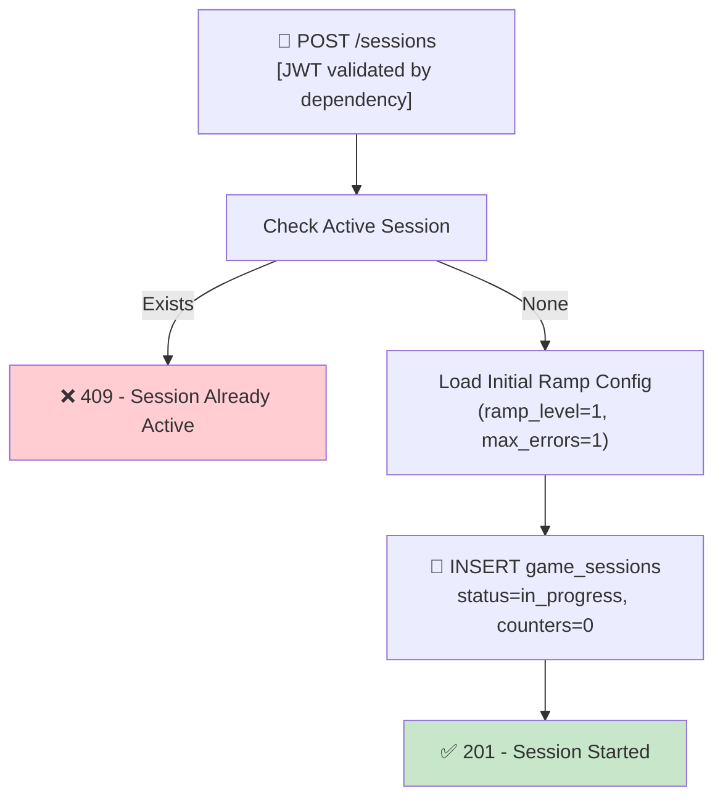

## 📝 Change History
| Date | Version | Changes | Status |
|------|---------|---------|--------|
| 2026-05-12 | 1.0.0 | Initial design | 📝 Draft |
| 2026-05-13 | 1.1.0 | Removed player difficulty selection (managed by SF06 ramp); auth treated as precondition; API router moved to `games/quick_calculate.py` for extensibility; response renamed to `initial_ramp_config` | ✅ Complete |
| 2026-05-13 | 1.2.0 | Removed `mode` parameter — game always runs endless-until-wrong (max_errors_allowed=1, max_questions=null); POST /sessions now takes no request body | ✅ Complete |
| 2026-05-14 | 1.3.0 | Refactored to Question bank architecture: `status` changed to `"active"` (was `"in_progress"`); `game_mode` now uses `GameMode` enum; `level_player_at_start` snapshot added; session no longer stores `difficulty_params` / counters — those are derived at query time | ✅ Complete |
| 2026-05-14 | 1.4.0 | Ramp switched to formula-based (`get_difficulty_params_for_count`); `initial_ramp_config` now only returns `ramp_level`, `time_limit_per_question`, `max_questions`, `max_errors_allowed` — `operation_types` and `number_range` removed (FE doesn't need them at session start); `time_limit_per_question` for level-1 player is now 15.0s (formula: 15 - correct_count/5) | ✅ Complete |

# G02_F04_SF01: Start Session

📝 MVP  
**Function**: Quick Calculate (G02_F04)  
**Status**: ✅ IMPLEMENTED  
**Priority**: High (Phase 2)  
**Difficulty**: Medium  

---

## 📋 Description

Initialize a Quick Calculate game session for an authenticated player. The player enters the game with no configuration required — there is no mode or difficulty selection. The game runs indefinitely, delivering increasingly difficult questions, until the player answers incorrectly or times out on a question. All session counters are reset to zero on creation and the initial ramp configuration is loaded from the server-side ramp table (SF06).

---

## 🎯 Detailed Requirements

### Input Parameters

**Request Body**: None (empty body or omit)

**Headers**
```
Authorization: Bearer <access_token>
```

**Validation Rules**
- No request body parameters required

### Output Schemas

**Success Response (201 Created)**
```json
{
  "success": true,
  "data": {
    "session_id": "uuid-v4",
    "initial_ramp_config": {
      "ramp_level": 1,
      "time_limit_per_question": 15.0,
      "max_questions": null,
      "max_errors_allowed": 1
    },
    "started_at": "2026-05-13T10:00:00Z"
  },
  "error": null
}
```

**Note**: `time_limit_per_question` is derived from `get_difficulty_params_for_count(0, player_level)` — for a level-1 player with 0 correct answers, the result is 15.0s. Higher player levels or more correct answers reduce this value.

Error codes: `SESSION_ALREADY_ACTIVE` (409), `UNAUTHORIZED` (401)

---

## 🗏️ Business Logic (4 Steps)

**Precondition**: User is authenticated — Bearer token validated via FastAPI `get_current_user_id()` dependency before this function executes.

1. **Check Active Session** - Query for any in-progress session for this user → Return 409 if one exists
2. **Load Initial Ramp Config** - Call `get_difficulty_params_for_count(0, level_at_start)` → `{level, time_limit}`; for a level-1 player this yields ramp_level=1, time_limit=15s; `max_errors_allowed=1` and `max_questions=null` are service constants
3. **Create Session Record** - INSERT into `game_sessions` with `status="active"`, `game_mode=GameMode.QUICK_CALCULATE`, `user_id`, and `level_player_at_start` (from `user_profiles.current_level`, default 1 if no profile); no counters stored — computed from `session_operations` at query time
4. **Return Session Data** - HTTP 201 with session_id, initial ramp config, and started_at timestamp

---

## 🔄 Flow Diagram



---

## 💻 Backend Implementation

**Status**: ✅ IMPLEMENTED  
**Location**: `app/api/v1/games/quick_calculate.py`, `app/services/quick_calculate_service.py`  
**Tests**: `tests/test_quick_calculate.py::TestStartSession`

### Architecture Overview

| Component | Purpose | Details |
|-----------|---------|---------|
| **Service Layer** | Business logic | Session creation, ramp config loading |
| **API Router** | HTTP endpoint | POST `/api/v1/games/quick-calculate/sessions` returns 201 |
| **Database Models** | Persistence | `game_sessions` table |
| **Ramp Config** | Initial params | `get_difficulty_params_for_count(0, level_at_start)` in `difficulty_ramp.py` |

### Implementation Highlights

✅ **Session creation**: INSERT into `game_sessions` with `status="active"`, `game_mode=GameMode.QUICK_CALCULATE`, `level_player_at_start` from user profile  
✅ **Active session guard**: Query for existing session with `status="active"` before creating new one  
✅ **Initial ramp config loading**: `get_difficulty_params_for_count(0, level_at_start)` returns `{level, time_limit}`; `max_errors_allowed=1` and `max_questions=null` are service constants added to the response  
✅ **No request body**: Endpoint accepts no input — game mode is fixed  
✅ **No counters in session**: `correct_count`, `wrong_count`, `streak` computed from `session_operations` at query time  
✅ **Async DB operations**: All queries via async SQLAlchemy session  

### Future Enhancements

- Support guest sessions (no auth required)
- Session resume (rejoin interrupted session)

---

## 📊 Security Considerations

| Area | Implementation |
|------|----------------|
| **Auth** | Bearer token required via FastAPI dependency; user_id extracted from JWT |
| **Session Isolation** | Each session scoped to user_id; cannot access others' sessions |
| **Server-controlled Difficulty** | Ramp config loaded server-side; client cannot manipulate difficulty or timing |

---

## ✅ Test Coverage

### Success Cases
- [x] `test_session_id_in_response` - Session created, ID returned in response
- [x] `test_initial_ramp_level_is_1` - ramp_level=1, time_limit=15s, max_errors=1, max_questions=null

### Error Cases
- [x] `test_duplicate_session_returns_409` - Duplicate session → 409 SESSION_ALREADY_ACTIVE
- [x] `test_unauthenticated_returns_401` - No token → 401

---

## 🚀 API Endpoint

**POST** `/api/v1/games/quick-calculate/sessions`

**Request Headers**
```
Authorization: Bearer <access_token>
```

**Request Body**: None

**Response Example (201)**
```json
{
  "success": true,
  "data": {
    "session_id": "550e8400-e29b-41d4-a716-446655440000",
    "initial_ramp_config": {
      "ramp_level": 1,
      "time_limit_per_question": 15.0,
      "max_questions": null,
      "max_errors_allowed": 1
    },
    "started_at": "2026-05-13T10:00:00Z"
  },
  "error": null
}
```

---

## 📋 Implementation Checklist

- [x] `game_sessions` database model
- [x] Ramp config — `get_difficulty_params_for_count(0, level_at_start)` with constants `max_errors_allowed=1`, `max_questions=null`
- [x] Service: `start_session(user_id, db)` — no mode parameter
- [x] API router: POST `/api/v1/games/quick-calculate/sessions` (no body)
- [x] Active session guard
- [x] Test suite

---

## 🔗 Related Documentation

- **Database Models**: `app/models/game_session.py`
- **Test Suite**: `tests/test_quick_calculate.py`
- **API Router**: `app/api/v1/games/quick_calculate.py`
- **Service Logic**: `app/services/quick_calculate_service.py`
- **Ramp Config**: `app/utils/difficulty_ramp.py`
- **Related Specs**: [G02_F04_SF02](G02_F04_SF02.md) (Generate Next Operation), [G02_F04_SF06](G02_F04_SF06.md) (Difficulty Ramp), [G02_F04_SF07](G02_F04_SF07.md) (End Session)

---

**Last Updated**: 2026-05-14 (v1.4.0)  
**Implementation Status**: ✅ IMPLEMENTED  
**Test Status**: ✅ ALL PASSING
