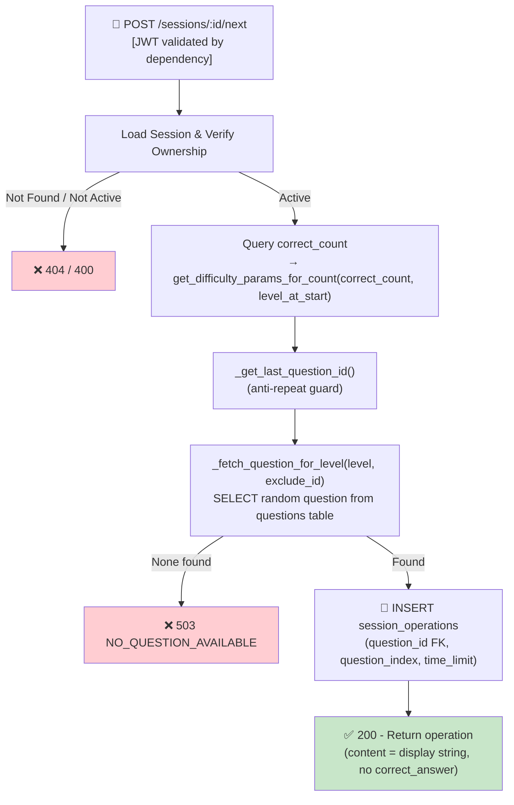

## 📝 Change History
| Date | Version | Changes | Status |
|------|---------|---------|--------|
| 2026-05-12 | 1.0.0 | Initial design | 📝 Draft |
| 2026-05-13 | 1.1.0 | Auth as precondition; API router moved to `games/quick_calculate.py` | ✅ Complete |
| 2026-05-14 | 2.0.0 | Question bank architecture: operation now generates a `Question` record and links it via FK; ramp params derived from `correct_count` (no longer from `session.difficulty_params`); response changed to `content` dict instead of flat fields; `generated_at` uses `session_operation.created_at` | ✅ Complete |
| 2026-05-14 | 2.1.0 | Ramp switched to `get_difficulty_params_for_count(correct_count, level_player_at_start)` (formula-based, player-level-aware); `get_level_config(level)` derives `number_range` + `operation_types`; `operation_generator.py` deleted — question generation now inline via `_generate_math_question()` in the service | ✅ Complete |
| 2026-05-14 | 2.2.0 | Removed inline question generation — SF02 now fetches a random pre-seeded question from the `questions` table by `difficulty_level`; `_generate_math_question()` and `_get_previous_op_tuple()` removed; replaced with `_fetch_question_for_level()` + `_get_last_question_id()`; `content` response field simplified to the display string stored in `questions.content` | ✅ Complete |

# G02_F04_SF02: Generate Next Operation

📝 MVP  
**Function**: Quick Calculate (G02_F04)  
**Status**: ✅ IMPLEMENTED  
**Priority**: High (Phase 2)  
**Difficulty**: Medium  

---

## 📋 Description

Generate the next math operation for the session. Creates a `Question` record in the question bank, then creates a `SessionOperation` linking it to the session. Ramp difficulty is derived from the session's running correct answer count (no persistent difficulty state needed). Prevents consecutive duplicate operations.

---

## 🎯 Detailed Requirements

### Input Parameters

**URL Parameter**: `session_id` (UUID v4, path param)

**Headers**
```
Authorization: Bearer <access_token>
```

**Validation Rules**
- `session_id`: Must exist, belong to authenticated user, and have `status="active"`

### Output Schemas

**Success Response (200 OK)**
```json
{
  "success": true,
  "data": {
    "operation_id": "uuid-v4",
    "question_id": "uuid-v4",
    "question_index": 3,
    "content": "24 ÷ 6 = ?",
    "time_limit": 8.0,
    "generated_at": "2026-05-14T10:00:05Z"
  },
  "error": null
}
```

**Note**: `correct_answer` is stored in `questions.correct_answer` only — never sent to the client.

Error codes: `SESSION_NOT_FOUND` (404), `SESSION_NOT_ACTIVE` (400), `UNAUTHORIZED` (401)

---

## 🗏️ Business Logic (7 Steps)

**Precondition**: User is authenticated — Bearer token validated via FastAPI `get_current_user_id()` dependency.

1. **Load Session** - Fetch session by session_id, verify owner = user_id, `status="active"` → 404/400 if not valid
2. **Compute Ramp** - Call `get_difficulty_params_for_count(correct_count, session.level_player_at_start)` → `{"level", "time_limit"}`
3. **Anti-Repeat Guard** - Query `_get_last_question_id(session_id)` to get the previous question's UUID
4. **Fetch Question** - Call `_fetch_question_for_level(level, exclude_id)` — selects a random `Question` from the `questions` table matching `difficulty_level`, excluding the last seen; raises 503 if none available
5. **Create Session Operation** - INSERT into `session_operations` with `question_id` FK, `question_index=total_count`, `time_limit`
6. **Return** - Response includes `content` (display string from `questions.content`) and `time_limit`; `correct_answer` is never sent to the client

---

## 🔄 Flow Diagram



---

## 💻 Backend Implementation

**Status**: ✅ IMPLEMENTED  
**Location**: `app/api/v1/games/quick_calculate.py`, `app/services/quick_calculate_service.py`  
**Tests**: `tests/test_quick_calculate.py::TestNextOperation`

### Architecture Overview

| Component | Purpose | Details |
|-----------|---------|---------|
| **`questions` table** | Question bank | Pre-seeded math questions; `content` = display string, `correct_answer` = integer |
| **`session_operations` table** | Player actions | Links session → question via FK; records player's answer |
| **`get_difficulty_params_for_count()`** | Level + timing | Returns `{"level", "time_limit"}` from formula (`base_level + correct_count//5`, `15 - correct_count//5`) |
| **`_fetch_question_for_level(level, exclude_id)`** | Question fetch | Selects a random `Question` at `difficulty_level=level`, excluding last seen question |
| **`_get_last_question_id(session_id)`** | Anti-repeat guard | Returns the `question_id` of the most recent operation in the session |

### Question Content Schema (type="math")

```json
{
  "type": "math",
  "content": "24 ÷ 6 = ?",
  "correct_answer": 4,
  "difficulty_level": 5
}
```

`content` is a plain display string stored in the question bank. `correct_answer` is never exposed to the client.

### Implementation Highlights

✅ **DB fetch**: Each call selects a random pre-seeded `Question` at the current ramp level; no question is generated at runtime  
✅ **Ramp derivation**: `get_difficulty_params_for_count(correct_count, level_player_at_start)` — formula-based, player-level-aware; no stored difficulty state  
✅ **Anti-repeat**: `_get_last_question_id()` passes the previous question's UUID as an exclusion filter  
✅ **Answer hiding**: `correct_answer` in `questions` table only, never in API response  
✅ **`generated_at`**: Uses `session_operation.created_at` (no separate column needed)  
✅ **503 guard**: Returns `NO_QUESTION_AVAILABLE` if the question bank has no entry at the requested level  

### Future Enhancements

- Multi-operand operations: `12 + 5 × 3 = ?`
- Support non-math question types (sequence, MCQ) via `type` field
- Admin tool for bulk-importing questions into the question bank

---

## 📊 Security Considerations

| Area | Implementation |
|------|----------------|
| **Answer Hiding** | `correct_answer` stored in `questions` table only, never sent to client |
| **Session Ownership** | `user_id` verified against `session.user_id` |
| **Server-controlled Difficulty** | Ramp computed server-side from correct_count; client cannot manipulate |

---

## ✅ Test Coverage

### Success Cases
- [x] `test_returns_operation_fields` - Response includes `operation_id`, `question_id`, `content`, `time_limit`, `generated_at`
- [x] `test_correct_answer_not_in_response` - `correct_answer` absent from response and `content`
- [x] `test_question_index_starts_at_zero` - First operation has `question_index=0`
- [x] `test_time_limit_matches_ramp_level_1` - `time_limit=15.0` at ramp_level=1 (formula: 15 - 0//5)

### Error Cases
- [x] `test_invalid_session_returns_404` - Non-existent session_id → 404

---

## 🚀 API Endpoint

**POST** `/api/v1/games/quick-calculate/sessions/{session_id}/next`

**Response Example (200)**
```json
{
  "success": true,
  "data": {
    "operation_id": "6ba7b810-9dad-11d1-80b4-00c04fd430c8",
    "question_id": "550e8400-e29b-41d4-a716-446655440000",
    "question_index": 3,
    "content": "24 ÷ 6 = ?",
    "time_limit": 8.0,
    "generated_at": "2026-05-14T10:00:05Z"
  },
  "error": null
}
```

---

## 📋 Implementation Checklist

- [x] `questions` database model (`type`, `content` JSON, `correct_answer` JSON, `difficulty_level`)
- [x] `session_operations` model with `question_id` FK
- [x] `get_difficulty_params_for_count(correct_count, player_level)` in `difficulty_ramp.py`
- [x] `_fetch_question_for_level(level, exclude_id)` — random DB fetch with anti-repeat
- [x] `_get_last_question_id(session_id)` — anti-repeat helper
- [x] Service: `generate_next_operation(session_id, user_id, db)`
- [x] API router: POST `/api/v1/games/quick-calculate/sessions/{id}/next`
- [x] Test suite (uses `seeded_questions` fixture for pre-populated question bank)

---

## 🔗 Related Documentation

- **Database Models**: `app/models/question.py`, `app/models/session_operation.py`
- **Test Suite**: `tests/test_quick_calculate.py`
- **API Router**: `app/api/v1/games/quick_calculate.py`
- **Service Logic**: `app/services/quick_calculate_service.py`
- **Utils**: `app/utils/difficulty_ramp.py`
- **Related Specs**: [G02_F04_SF01](G02_F04_SF01.md) (Start Session), [G02_F04_SF03](G02_F04_SF03.md) (Timeout), [G02_F04_SF06](G02_F04_SF06.md) (Difficulty Ramp)

---

**Last Updated**: 2026-05-14 (v2.2.0)  
**Implementation Status**: ✅ IMPLEMENTED  
**Test Status**: ✅ ALL PASSING
