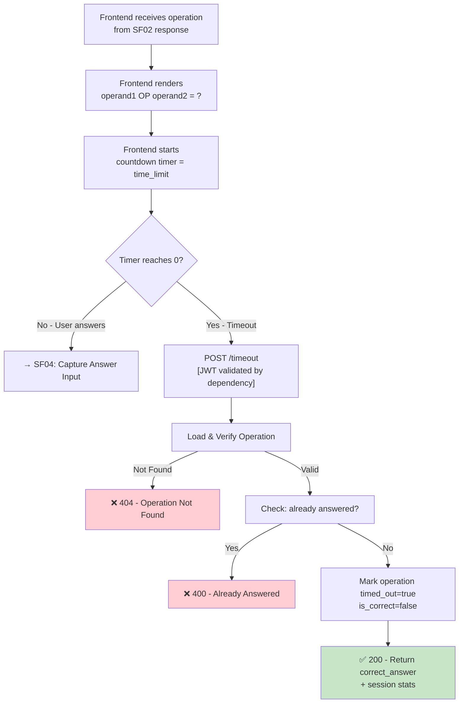

## 📝 Change History
| Date | Version | Changes | Status |
|------|---------|---------|--------|
| 2026-05-12 | 1.0.0 | Initial design | 📝 Draft |
| 2026-05-13 | 1.1.0 | Auth as precondition; translated input parameters description to English; API router moved to `games/quick_calculate.py` | ✅ Complete |
| 2026-05-13 | 1.2.0 | Timeout auto-ends session (max_errors_allowed=1); added `session_ended` and `end_reason` to response | ✅ Complete |
| 2026-05-14 | 1.3.0 | Question bank architecture: `correct_answer` now fetched from `questions` table via `question_id` FK; session stats computed from `session_operations` queries | ✅ Complete |

# G02_F04_SF03: Display Operation & Countdown

📝 MVP  
**Function**: Quick Calculate (G02_F04)  
**Status**: ✅ IMPLEMENTED  
**Priority**: High (Phase 2)  
**Difficulty**: Low  

---

## 📋 Description

Provide data to display the current operation and count down the answer time. The backend supplies the `time_limit` per question; the frontend manages the countdown UI locally. When the timer expires, the frontend sends a timeout signal to the server.

---

## 🎯 Detailed Requirements

### Input Parameters

There is no separate request body — operation data is already returned by SF02 (Generate Next Operation). SF03 represents the frontend logic that receives that data and renders it.

The backend only handles the **timeout signal** when the player's timer expires:

**Timeout Notification (POST)**
```json
{
  "session_id": "550e8400-e29b-41d4-a716-446655440000",
  "operation_id": "6ba7b810-9dad-11d1-80b4-00c04fd430c8",
  "event": "timeout"
}
```

**Headers**
```
Authorization: Bearer <access_token>
```

### Output Schemas

**Success Response (200 OK)**
```json
{
  "success": true,
  "data": {
    "operation_id": "6ba7b810-9dad-11d1-80b4-00c04fd430c8",
    "timed_out": true,
    "correct_answer": 4,
    "session_stats": {
      "correct_count": 3,
      "wrong_count": 1,
      "questions_answered": 4,
      "current_streak": 0
    },
    "session_ended": true,
    "end_reason": "max_errors"
  },
  "error": null
}
```

**Note**: `correct_answer` is fetched from `questions.correct_answer` and revealed only after timeout. `session_ended=true` always for Quick Calculate (max_errors_allowed=1).

Error codes: `OPERATION_NOT_FOUND` (404), `OPERATION_ALREADY_ANSWERED` (400), `SESSION_NOT_ACTIVE` (400), `UNAUTHORIZED` (401)

---

## 🗏️ Business Logic (4 Steps — Timeout Handler)

**Precondition**: User is authenticated — Bearer token validated via FastAPI `get_current_user_id()` dependency before this function executes.

1. **Load Operation** - Fetch `session_operations` record by operation_id, verify it belongs to session_id and user_id → Return 404 if not found
2. **Check Operation State** - If already answered/timed_out → Return 400 (idempotent safety)
3. **Record Timeout** - Mark operation as `timed_out=true`, `answered_at=NOW()`, `user_answer=null`, `is_correct=false`
4. **Return Reveal** - Return `correct_answer` (for frontend feedback display) and updated session stats

---

## 🔄 Flow Diagram



---

## 💻 Backend Implementation

**Status**: ✅ IMPLEMENTED  
**Location**: `app/api/v1/games/quick_calculate.py`, `app/services/quick_calculate_service.py`  
**Tests**: `tests/test_quick_calculate.py::TestTimeout`

### Architecture Overview

| Component | Purpose | Details |
|-----------|---------|---------|
| **Frontend (UI)** | Countdown rendering | Manages timer tick locally using `time_limit` from SF02 |
| **Backend** | Timeout recording | Handles timeout signal, updates `session_operations` |
| **API Router** | HTTP endpoint | POST `/api/v1/games/quick-calculate/sessions/{id}/timeout` |

### Design Decision: Client-side Timer

The countdown timer runs **client-side** (no WebSocket required for MVP). Backend receives a timeout signal when the timer expires. This keeps complexity low while maintaining server-side state integrity.

**Trade-off**: Client could theoretically delay the timeout. Accepted for MVP; server-side timestamp validation can be added later.

### Implementation Highlights

✅ **Timeout recording**: Marks operation as `timed_out=True`, `is_correct=False`, `evaluated_at=NOW()`  
✅ **Answer reveal**: `correct_answer` fetched from `questions` table via `question_id` FK, returned in response  
✅ **Session auto-end**: `_check_end_conditions(wrong_count)` always triggers (max_errors=1); `_finalize_session()` called automatically  
✅ **Idempotency guard**: Rejects duplicate timeout signals for already-answered/timed-out operations  
✅ **Stats from queries**: `correct_count`, `wrong_count`, `current_streak` computed from `session_operations` — no counters on session  

### Future Enhancements

- WebSocket-based real-time timer sync (anti-cheat for competitive mode)
- Server-side time validation: reject answers submitted after `generated_at + time_limit + tolerance`

---

## 📊 Security Considerations

| Area | Implementation |
|------|----------------|
| **Time Tolerance** | Accept answers within `time_limit + 2s` server-side tolerance |
| **Idempotency** | Re-sending timeout for already-answered operation returns 400 |
| **Answer Reveal** | `correct_answer` only returned after timeout/answer submission, never before |

---

## ✅ Test Coverage

### Success Cases
- [x] `test_timeout_reveals_correct_answer` - Response includes `correct_answer` and `timed_out=True`
- [x] `test_timeout_increments_wrong_count` - `wrong_count=1`, `current_streak=0` in session_stats
- [x] `test_timeout_ends_session` - `session_ended=True`, `end_reason="max_errors"`

### Error Cases
- [x] `test_cannot_get_next_op_after_timeout` - Ended session → 400 `SESSION_NOT_ACTIVE`

---

## 🚀 API Endpoint

**POST** `/api/v1/games/quick-calculate/sessions/{session_id}/timeout`

**Request Body**
```json
{
  "operation_id": "6ba7b810-9dad-11d1-80b4-00c04fd430c8"
}
```

**Response Example (200)**
```json
{
  "success": true,
  "data": {
    "operation_id": "6ba7b810-9dad-11d1-80b4-00c04fd430c8",
    "timed_out": true,
    "correct_answer": 4,
    "session_stats": {
      "correct_count": 3,
      "wrong_count": 2,
      "questions_answered": 5
    }
  },
  "error": null
}
```

---

## 📋 Implementation Checklist

- [x] `timed_out`, `is_correct`, `evaluated_at` fields on `session_operations` model
- [x] `questions.correct_answer` fetched via `question_id` FK
- [x] Pydantic schema: `TimeoutRequest`
- [x] Service: `record_timeout(session_id, operation_id, user_id, db)`
- [x] Idempotency guard (already answered / timed_out check)
- [x] `session_ended` + `end_reason` in response
- [x] API router: POST `/api/v1/games/quick-calculate/sessions/{id}/timeout`
- [x] Test suite

---

## 🔗 Related Documentation

- **Database Models**: `app/models/session_operation.py`
- **Test Suite**: `tests/test_quick_calculate.py`
- **API Router**: `app/api/v1/games/quick_calculate.py`
- **Service Logic**: `app/services/quick_calculate_service.py`
- **Related Specs**: [G02_F04_SF02](G02_F04_SF02.md) (Generate Next Operation), [G02_F04_SF04](G02_F04_SF04.md) (Capture Answer Input), [G02_F04_SF06](G02_F04_SF06.md) (Difficulty Ramp)

---

**Last Updated**: 2026-05-14  
**Implementation Status**: ✅ IMPLEMENTED  
**Test Status**: ✅ ALL PASSING
