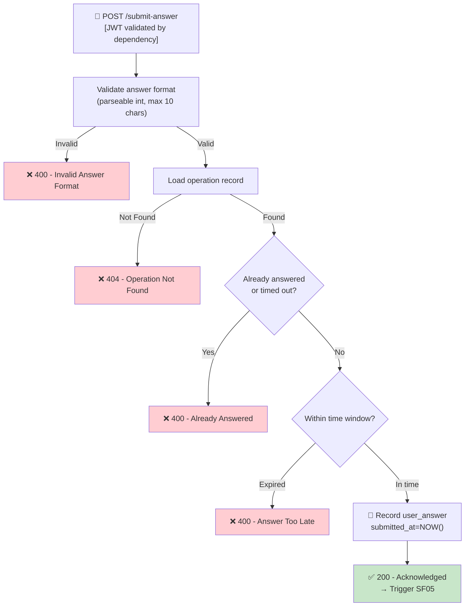

## 📝 Change History
| Date | Version | Changes | Status |
|------|---------|---------|--------|
| 2026-05-12 | 1.0.0 | Initial design | 📝 Draft |
| 2026-05-13 | 1.1.0 | Auth as precondition (not a business logic step); API router moved to `games/quick_calculate.py` for extensibility | 🔄 In Progress |

# G02_F04_SF04: Capture Answer Input

📝 MVP  
**Function**: Quick Calculate (G02_F04)  
**Status**: 📝 PLANNED  
**Priority**: High (Phase 2)  
**Difficulty**: Low  

---

## 📋 Description

Accept the player's answer input (numeric buttons or keyboard on the frontend), supporting corrections before final submission. The backend handles the submit action — receiving `session_id`, `operation_id`, and `answer`, then recording the server-side submission timestamp.

---

## 🎯 Detailed Requirements

### Input Parameters

**Request Body (JSON)**
```json
{
  "session_id": "550e8400-e29b-41d4-a716-446655440000",
  "operation_id": "6ba7b810-9dad-11d1-80b4-00c04fd430c8",
  "answer": "4",
  "submitted_at": "2026-05-12T10:00:07.345Z"
}
```

**Headers**
```
Authorization: Bearer <access_token>
```

**Validation Rules**
- `session_id`: Required, UUID v4
- `operation_id`: Required, UUID v4
- `answer`: Required, string, max 10 chars, must be parseable as integer (or decimal if config allows)
- `submitted_at`: Optional ISO 8601 timestamp (client-reported; server records own timestamp too)

### Output Schemas

**Success Response (200 OK)**
```json
{
  "success": true,
  "data": {
    "operation_id": "6ba7b810-9dad-11d1-80b4-00c04fd430c8",
    "received": true,
    "server_received_at": "2026-05-12T10:00:07.400Z"
  },
  "error": null
}
```

**Note**: SF04 only acknowledges receipt. Correctness evaluation is done in SF05.

Error codes: `INVALID_ANSWER_FORMAT` (400), `OPERATION_NOT_FOUND` (404), `OPERATION_ALREADY_ANSWERED` (400), `SESSION_NOT_ACTIVE` (400), `ANSWER_TOO_LATE` (400), `UNAUTHORIZED` (401)

---

## 🗏️ Business Logic (6 Steps)

**Precondition**: User is authenticated — Bearer token validated via FastAPI `get_current_user_id()` dependency before this function executes.

1. **Validate Answer Format** - Check answer is non-empty, max 10 chars, parseable as integer → Return 400 if invalid
2. **Load Operation** - Fetch `session_operations` record by operation_id, verify belongs to session and user → Return 404 if not found
3. **Check Operation State** - If already answered or timed out → Return 400 (idempotency)
4. **Check Time Window** - Compare server_received_at against `generated_at + time_limit + tolerance(2s)` → Return 400 `ANSWER_TOO_LATE` if expired
5. **Record Submission** - Store `user_answer`, `submitted_at=NOW()` on the operation record (not yet evaluated)
6. **Acknowledge** - Return 200 with `received=true` and server timestamp; pass to SF05 for evaluation

---

## 🔄 Flow Diagram



---

## 💻 Backend Implementation

**Status**: 📝 PLANNED  
**Location**: `app/api/v1/games/quick_calculate.py`, `app/services/quick_calculate_service.py`  
**Tests**: Not yet written

### Architecture Overview

| Component | Purpose | Details |
|-----------|---------|---------|
| **Pydantic Schemas** | Input validation | Answer format, UUID validation |
| **Service Layer** | Business logic | Time window check, idempotency guard, record answer |
| **API Router** | HTTP endpoint | POST `/api/v1/games/quick-calculate/sessions/{id}/answer` |
| **Evaluation Trigger** | Chaining | Internally calls SF05 after recording; or SF05 runs in same transaction |

### Design Decision: SF04 + SF05 Coupling

SF04 and SF05 can be called in sequence within the same API request:
1. SF04 records the submission
2. SF05 evaluates correctness
3. Combined response returned

This avoids an extra round-trip. The endpoint returns both acknowledgment AND evaluation result.

### Implementation Highlights

⬜ **Answer format validation**: Parses answer as integer, rejects non-numeric input (max 10 chars)  
⬜ **Time window check**: Server-side validation — `NOW() <= generated_at + time_limit + 2s tolerance`  
⬜ **Idempotency guard**: Duplicate submission for same `operation_id` returns 400  
⬜ **Ownership chain**: `operation_id` → `session_id` → `user_id` all verified in sequence  
⬜ **Client timestamp**: Client-reported `submitted_at` stored for analytics; server timestamp used for validation  

### Future Enhancements

- Real-time answer streaming (WebSocket) for competitive mode
- Decimal answer support for advanced math levels

---

## 📊 Security Considerations

| Area | Implementation |
|------|----------------|
| **Time Validation** | Server-side check: `NOW() <= generated_at + time_limit + 2s tolerance` |
| **Answer Sanitization** | Parse as integer, reject non-numeric input |
| **Idempotency** | Duplicate submission returns 400 with existing result |
| **Ownership** | `operation_id` must belong to `session_id` which must belong to `user_id` |

---

## ✅ Test Coverage (Planned)

### Success Cases
- [ ] `test_submit_correct_answer` - Valid answer within time → 200 acknowledged
- [ ] `test_submit_negative_answer` - Negative integers accepted (e.g., `"-3"`)
- [ ] `test_submit_answer_with_spaces` - Trim whitespace, still valid

### Error Cases
- [ ] `test_submit_invalid_format` - `"abc"` answer → 400
- [ ] `test_submit_empty_answer` - Empty string → 400
- [ ] `test_submit_too_long` - > 10 chars → 400
- [ ] `test_submit_duplicate` - Submit twice → 400 Already Answered
- [ ] `test_submit_too_late` - After time_limit + tolerance → 400 Too Late
- [ ] `test_submit_wrong_session` - operation_id not in session → 404

---

## 🚀 API Endpoint

**POST** `/api/v1/games/quick-calculate/sessions/{session_id}/answer`

**Request Body**
```json
{
  "operation_id": "6ba7b810-9dad-11d1-80b4-00c04fd430c8",
  "answer": "4",
  "submitted_at": "2026-05-12T10:00:07.345Z"
}
```

**Response Example (200)**
```json
{
  "success": true,
  "data": {
    "operation_id": "6ba7b810-9dad-11d1-80b4-00c04fd430c8",
    "received": true,
    "server_received_at": "2026-05-12T10:00:07.400Z"
  },
  "error": null
}
```

---

## 📋 Implementation Checklist

- [ ] `user_answer`, `submitted_at` fields on `session_operations` model
- [ ] Pydantic schema: SubmitAnswerRequest / SubmitAnswerAckResponse
- [ ] Time window validation logic (tolerance configurable)
- [ ] Idempotency guard (already answered check)
- [ ] Service: `capture_answer(session_id, operation_id, answer, user_id)`
- [ ] API router: POST `/api/v1/games/quick-calculate/sessions/{id}/answer`
- [ ] Test suite

---

## 🔗 Related Documentation

- **Database Models**: `app/models/session_operation.py`
- **Test Suite**: `tests/test_quick_calculate.py`
- **API Router**: `app/api/v1/games/quick_calculate.py`
- **Service Logic**: `app/services/quick_calculate_service.py`
- **Related Specs**: [G02_F04_SF03](G02_F04_SF03.md) (Display & Countdown), [G02_F04_SF05](G02_F04_SF05.md) (Evaluate Answer)

---

**Last Updated**: 2026-05-13  
**Implementation Status**: 📝 PLANNED  
**Test Status**: ⏳ NOT STARTED
