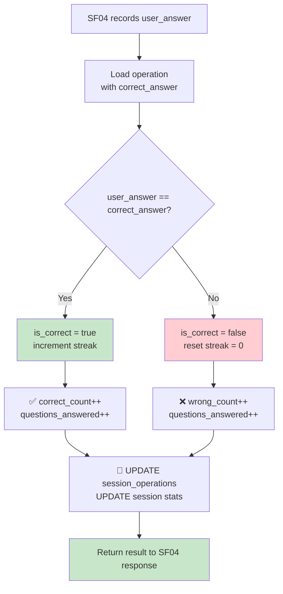

## 📝 Change History
| Date | Version | Changes | Status |
|------|---------|---------|--------|
| 2026-05-12 | 1.0.0 | Initial design | 📝 Draft |
| 2026-05-13 | 1.1.0 | No structural changes; updated for consistency with SF01–SF04 revisions | 🔄 In Progress |

# G02_F04_SF05: Evaluate Answer Correctness

📝 MVP  
**Function**: Quick Calculate (G02_F04)  
**Status**: 📝 PLANNED  
**Priority**: High (Phase 2)  
**Difficulty**: Low  

---

## 📋 Description

Evaluate the correctness of the player's submitted answer. Update the consecutive correct streak where applicable. Record the current question result in the session stats. EXP and reward processing are not handled here — that is the responsibility of SF07 and SF08.

---

## 🎯 Detailed Requirements

### Input Parameters

SF05 được gọi nội bộ ngay sau SF04 trong cùng một API request. Không có endpoint riêng biệt.

**Internal call parameters**
```python
evaluate_answer(
    session_id: str,
    operation_id: str,
    user_id: int
)
```

### Output Schemas

**Kết quả trả về cùng response của SF04 (combined)**
```json
{
  "success": true,
  "data": {
    "operation_id": "6ba7b810-9dad-11d1-80b4-00c04fd430c8",
    "is_correct": true,
    "correct_answer": 4,
    "user_answer": 4,
    "consecutive_correct": 5,
    "session_stats": {
      "correct_count": 5,
      "wrong_count": 1,
      "questions_answered": 6,
      "current_streak": 5
    }
  },
  "error": null
}
```

Error codes: `OPERATION_NOT_SUBMITTED` (400), `OPERATION_NOT_FOUND` (404)

---

## 🗏️ Business Logic (6 Steps)

1. **Load Operation** - Fetch `session_operations` by operation_id, confirm `user_answer` is set (SF04 already ran)
2. **Compare Answers** - Parse `user_answer` as int and compare with stored `correct_answer` (exact match)
3. **Update Operation Record** - Set `is_correct`, `evaluated_at=NOW()` on the operation
4. **Update Streak** - If `is_correct=true`: increment `session.current_streak`; if `is_correct=false`: reset `session.current_streak=0`
5. **Update Session Counters** - Increment `session.correct_count` or `session.wrong_count`, increment `session.questions_answered`
6. **Return Evaluation** - Return `is_correct`, `correct_answer` (for UI feedback), and updated `session_stats`

---

## 🔄 Flow Diagram



---

## 💻 Backend Implementation

**Status**: 📝 PLANNED  
**Location**: `app/services/quick_calculate_service.py`  
**Tests**: Not yet written (tested via SF04 endpoint tests)

### Architecture Overview

| Component | Purpose | Details |
|-----------|---------|---------|
| **Service Layer** | Evaluation logic | Answer comparison, streak update, counter increment |
| **Database Models** | Persistence | `session_operations.is_correct`, `game_sessions.correct_count/wrong_count/current_streak` |
| **Combined Response** | UX | Returns result as part of SF04 answer submission response |

### Session Stats Fields

| Field | Type | Description |
|-------|------|-------------|
| `correct_count` | int | Total correct answers in session |
| `wrong_count` | int | Total wrong answers in session |
| `questions_answered` | int | `correct_count + wrong_count` |
| `current_streak` | int | Consecutive correct answers (resets on wrong) |
| `max_streak` | int | Highest streak achieved in session |

### Implementation Highlights

⬜ **Server-side evaluation**: `user_answer` compared to stored `correct_answer` — never client-trusted  
⬜ **Streak tracking**: `current_streak` incremented on correct answer, reset to 0 on wrong  
⬜ **Max streak persistence**: `max_streak` updated whenever `current_streak` exceeds previous max  
⬜ **Atomic counters**: `correct_count` / `wrong_count` updated in same DB transaction as `is_correct`  
⬜ **Combined response**: Evaluation result merged into SF04 response — no extra round-trip  

### Future Enhancements

- Partial credit for near-miss answers (e.g., off by 1 in advanced mode)
- Weighted scoring based on difficulty of the specific operation
- Streak milestone detection → trigger SF06 faster ramp

---

## 📊 Security Considerations

| Area | Implementation |
|------|----------------|
| **Server-side Evaluation** | `correct_answer` never sent to client before evaluation; comparison done server-side only |
| **No Client Trust** | `is_correct` computed by server, never accepted from client input |
| **Atomic Update** | Session counters updated atomically with operation result to prevent race conditions |

---

## ✅ Test Coverage (Planned)

### Success Cases
- [ ] `test_correct_answer_increments_correct_count` - Correct answer → correct_count+1, streak+1
- [ ] `test_wrong_answer_increments_wrong_count` - Wrong answer → wrong_count+1, streak reset to 0
- [ ] `test_streak_reset_on_wrong` - Streak 5 then wrong → streak=0
- [ ] `test_streak_continues_on_correct` - 3 correct in a row → streak=3
- [ ] `test_max_streak_tracked` - Max streak persisted even after reset

### Edge Cases
- [ ] `test_answer_zero_correct` - Operation result is 0, user answers 0 → correct
- [ ] `test_negative_answer` - Operation result is -3, user answers -3 → correct

---

## 🚀 API Endpoint

SF05 has no dedicated endpoint. Results are returned as part of the SF04 answer submission response.

**POST** `/api/v1/games/quick-calculate/sessions/{session_id}/answer`

**Full Combined Response (200)**
```json
{
  "success": true,
  "data": {
    "operation_id": "6ba7b810-9dad-11d1-80b4-00c04fd430c8",
    "received": true,
    "server_received_at": "2026-05-12T10:00:07.400Z",
    "is_correct": true,
    "correct_answer": 4,
    "user_answer": 4,
    "consecutive_correct": 5,
    "session_stats": {
      "correct_count": 5,
      "wrong_count": 1,
      "questions_answered": 6,
      "current_streak": 5
    }
  },
  "error": null
}
```

---

## 📋 Implementation Checklist

- [ ] `is_correct`, `evaluated_at` fields on `session_operations` model
- [ ] `correct_count`, `wrong_count`, `current_streak`, `max_streak` fields on `game_sessions` model
- [ ] Service: `evaluate_answer(session_id, operation_id, user_id) -> EvaluationResult`
- [ ] Atomic DB update: operation + session counters in same transaction
- [ ] Combined Pydantic response schema (SF04 + SF05 merged)
- [ ] Test suite (via SF04 endpoint)

---

## 🔗 Related Documentation

- **Database Models**: `app/models/session_operation.py`, `app/models/game_session.py`
- **Test Suite**: `tests/test_quick_calculate.py`
- **Service Logic**: `app/services/quick_calculate_service.py`
- **Related Specs**: [G02_F04_SF04](G02_F04_SF04.md) (Capture Answer Input), [G02_F04_SF06](G02_F04_SF06.md) (Difficulty Ramp), [G02_F04_SF07](G02_F04_SF07.md) (End Session)

---

**Last Updated**: 2026-05-13  
**Implementation Status**: 📝 PLANNED  
**Test Status**: ⏳ NOT STARTED
