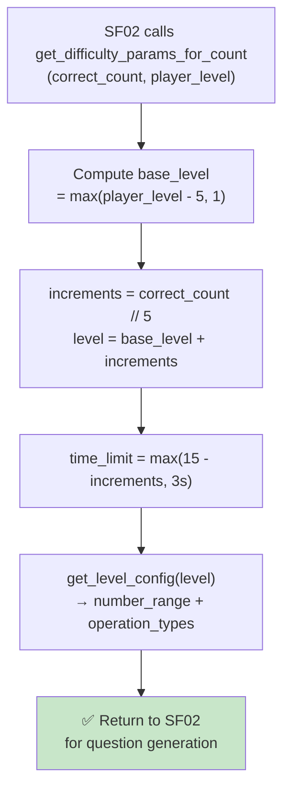

## 📝 Change History
| Date | Version | Changes | Status |
|------|---------|---------|--------|
| 2026-05-12 | 1.0.0 | Initial design | 📝 Draft |
| 2026-05-13 | 1.1.0 | SF01 now loads initial ramp params from this config; SF06 owns all difficulty progression after session start | ✅ Complete |
| 2026-05-13 | 1.2.0 | Updated initial params: max_questions=null (unlimited), max_errors_allowed=1 (game ends on first wrong answer or timeout) | ✅ Complete |
| 2026-05-14 | 1.3.0 | Added `get_ramp_params_for_count(correct_count)` — derives ramp level directly from correct_count without reading `session.difficulty_params` (session no longer stores difficulty state) | ✅ Complete |
| 2026-05-14 | 1.4.0 | Simplified `get_ramp_params_for_count()` to return only `{"level", "time_limit"}` — question-generation config (number_range, operation_types) moved to `get_level_config(level)` to separate concerns | ✅ Complete |
| 2026-05-14 | 1.5.0 | Replaced `RAMP_TABLE` + `RampStep` with formula-based approach: `level = max(player_level - 5, 1) + correct_count // 5`, `time_limit = 15 - correct_count // 5` (clamped at 3s). Renamed `get_ramp_params_for_count` → `get_difficulty_params_for_count(correct_count, player_level)`. `get_level_config(level)` now formula-based (`max_num = 10 + level * 10`). `evaluate_ramp`, `get_initial_ramp_params`, `RAMP_TABLE` removed. `operation_generator.py` deleted — generation moved inline to service. | ✅ Complete |

# G02_F04_SF06: Increase Difficulty / Speed Ramp

📝 MVP  
**Function**: Quick Calculate (G02_F04)  
**Status**: ✅ IMPLEMENTED  
**Priority**: Medium (Phase 2)  
**Difficulty**: Medium  

---

## 📋 Description

Adjust difficulty and speed based on the player's progress: reduce the time allowed per question and/or increase operation complexity (number range, operation types) using a formula derived from the player's level and their correct answer count. Called internally before every new question (SF02). The game has no question limit — it runs until the player answers incorrectly or times out (`max_errors_allowed=1`).

---

## 🎯 Detailed Requirements

### Input Parameters

SF06 is called internally by SF02 before each question. No dedicated endpoint for MVP.

**Internal call parameters**
```python
get_difficulty_params_for_count(
    correct_count: int,   # session's current correct answer count
    player_level: int,    # player's level at session start (from level_player_at_start)
) -> dict                 # {"level": int, "time_limit": float}
```

### Output Schemas

Returned directly to SF02 for question generation — not persisted to the session.

```python
# get_difficulty_params_for_count result
{"level": int, "time_limit": float}

# get_level_config result (derived from level above)
{"number_range": {"min": int, "max": int}, "operation_types": list[str]}
```

---

## 🗏️ Business Logic (3 Steps)

1. **Compute Level** - `base_level = max(player_level - 5, 1)`; `increments = correct_count // 5`; `level = base_level + increments` — grows by 1 for every 5 correct answers
2. **Compute Time Limit** - `time_limit = max(15.0 - increments, MIN_TIME_LIMIT)` — starts at 15s, drops by 1s every 5 correct answers, floor 3s
3. **Derive Level Config** - `get_level_config(level)` computes `number_range` and `operation_types` from level: `max_num = min(10 + level*10, 200)`; `*` unlocked at level ≥ 3; `/` unlocked at level ≥ 5; caller uses this for question generation

---

## 🔄 Flow Diagram



---

## 💻 Backend Implementation

**Status**: ✅ IMPLEMENTED  
**Location**: `app/utils/difficulty_ramp.py`, `app/services/quick_calculate_service.py`  
**Tests**: `tests/test_quick_calculate.py::TestDifficultyRamp`

### Architecture Overview

| Component | Purpose | Details |
|-----------|---------|---------|
| **`get_difficulty_params_for_count(correct_count, player_level)`** | Level + timing | Returns `{"level": int, "time_limit": float}` — formula-based, player-level-aware |
| **`get_level_config(level)`** | Question-generation config | Returns `{"number_range": ..., "operation_types": [...]}` — formula: `max_num = min(10 + level*10, 200)` |
| **`MIN_TIME_LIMIT`** | Time floor | Constant `3.0s` — time_limit never drops below this |
| **Service Layer** | Integration | `generate_next_operation` calls `get_difficulty_params_for_count()` then `get_level_config()` then `_generate_math_question()` |
| **Database Models** | Persistence | Ramp level stored in `questions.difficulty_level` per question; no session column |

### Ramp Formula

```
base_level  = max(player_level - 5, 1)
increments  = correct_count // 5
level       = base_level + increments
time_limit  = max(15.0 - increments, 3.0)
```

**Example (player_level=1)**

| correct_count | increments | level | time_limit | max_num | Operations |
|---------------|-----------|-------|------------|---------|------------|
| 0–4 | 0 | 1 | 15s | 20 | `+`, `-` |
| 5–9 | 1 | 2 | 14s | 30 | `+`, `-` |
| 10–14 | 2 | 3 | 13s | 40 | `+`, `-`, `*` |
| 20–24 | 4 | 5 | 11s | 60 | `+`, `-`, `*`, `/` |
| 60+ | 12 | 13 | 3s (floor) | 140 | `+`, `-`, `*`, `/` |

**Time limit floor**: Never go below `MIN_TIME_LIMIT = 3.0` seconds.

**Player level effect**: A player at level 10 starts with `base_level=5` — they begin at a harder level than a level-1 player.

**Session termination**: `max_errors_allowed=1` — the session auto-ends immediately on the first wrong answer or timeout.

### Implementation Highlights

✅ **`get_difficulty_params_for_count(correct_count, player_level)`**: Formula-based; returns `{"level", "time_limit"}` — player's level shifts the starting difficulty  
✅ **`get_level_config(level)`**: Returns `{"number_range", "operation_types"}` — formula-based (`max_num = min(10 + level*10, 200)`)  
✅ **Time floor clamp**: `time_limit` clamped at `MIN_TIME_LIMIT = 3.0s`  
✅ **Op type unlocking**: `*` unlocked at level ≥ 3, `/` unlocked at level ≥ 5  
✅ **Ramp level in question bank**: Each generated question stores `difficulty_level` in `questions` table  
✅ **No session difficulty state**: Ramp derived on demand from `correct_count` + `level_player_at_start`  
✅ **Unlimited questions**: `max_questions=None` — ramp continues indefinitely until wrong answer  

### Future Enhancements

- Streak-based ramp (3 consecutive correct → speed up)
- Per-user adaptive ramp based on historical performance
- Configurable ramp tables per game type

---

## 📊 Security Considerations

| Area | Implementation |
|------|----------------|
| **Server-controlled** | Ramp params computed server-side; client cannot manipulate difficulty |
| **Clamped floor** | `time_limit` never below `MIN_TIME_LIMIT`; prevents instant-timeout abuse |
| **Config validation** | Ramp config is hardcoded at startup, not runtime user input |

---

## ✅ Test Coverage

### Unit Tests (no HTTP — `TestDifficultyRamp`)
- [x] `test_level_1_player_starts_at_level_1` - correct_count=0, player_level=1 → level=1, time_limit=15s, only 2 keys
- [x] `test_correct_count_advances_level` - 5 correct → level=2; 10 correct → level=3
- [x] `test_player_level_sets_base_level` - player_level=10 → base_level=5; player_level=3 → base_level=1
- [x] `test_time_limit_decreases_with_correct_count` - every 5 correct → -1s
- [x] `test_time_floor_never_below_3` - 1000 correct → time_limit clamped at 3s
- [x] `test_get_level_config_level_1_ops_and_range` - level=1 → max=20, ops={+,-}
- [x] `test_get_level_config_unlocks_multiplication_at_level_3` - level=2 no `*`, level=3 has `*`
- [x] `test_get_level_config_unlocks_division_at_level_5` - level=4 no `/`, level=5 has `/`
- [x] `test_get_level_config_higher_level_larger_range` - level=5 max > level=1 max
- [x] `test_get_level_config_clamps_low_level_to_1` - level=0 → same as level=1

---

## 🚀 API Endpoint

SF06 has no dedicated API endpoint. It is an internal utility function called after every answer submission or timeout.

The updated difficulty params are automatically applied by SF02 when generating the next question.

---

## 📋 Implementation Checklist

- [x] `get_difficulty_params_for_count(correct_count, player_level)` — formula-based; returns `{"level", "time_limit"}`
- [x] `get_level_config(level)` — formula-based; returns `{"number_range", "operation_types"}`
- [x] `MIN_TIME_LIMIT = 3.0` — time floor constant
- [x] Op type unlock logic (level ≥ 3 → `*`, level ≥ 5 → `/`)
- [x] Integration in `generate_next_operation` (SF02 calls both functions before each question)
- [x] `_check_end_conditions(wrong_count)` in service (max_errors=1 constant, no session state)
- [x] Unit tests for `get_difficulty_params_for_count` and `get_level_config`

---

## 🔗 Related Documentation

- **Database Models**: `app/models/game_session.py`
- **Test Suite**: `tests/test_quick_calculate.py`
- **Utils**: `app/utils/difficulty_ramp.py`
- **Service Logic**: `app/services/quick_calculate_service.py`
- **Related Specs**: [G02_F04_SF01](G02_F04_SF01.md) (Start Session), [G02_F04_SF03](G02_F04_SF03.md) (Timeout), [G02_F04_SF05](G02_F04_SF05.md) (Evaluate Answer), [G02_F04_SF02](G02_F04_SF02.md) (Generate Next Operation)

---

**Last Updated**: 2026-05-14 (v1.5.0)  
**Implementation Status**: ✅ IMPLEMENTED  
**Test Status**: ✅ ALL PASSING
