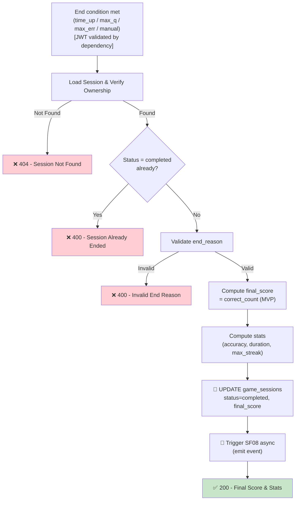

## 📝 Change History
| Date | Version | Changes | Status |
|------|---------|---------|--------|
| 2026-05-12 | 1.0.0 | Initial design | 📝 Draft |
| 2026-05-13 | 1.1.0 | Auth as precondition (not a business logic step); API router moved to `games/quick_calculate.py` for extensibility | 🔄 In Progress |

# G02_F04_SF07: End Session & Compute Score

📝 MVP  
**Function**: Quick Calculate (G02_F04)  
**Status**: 📝 PLANNED  
**Priority**: High (Phase 2)  
**Difficulty**: Medium  

---

## 📋 Description

End the game session when a termination condition is met (total time expired, maximum questions reached, or error limit exceeded — depending on the mode rules). Compute the final score (primary metric: correct answer count), calculate full session statistics, and update the session status to `completed`.

---

## 🎯 Detailed Requirements

### End Conditions (triggers)

| Trigger | Description |
|---------|-------------|
| `time_up` | Session timer (total game time) reaches 0 |
| `max_questions` | `questions_answered` reaches config max (e.g., 20) |
| `max_errors` | `wrong_count` exceeds allowed limit (if mode has error cap) |
| `manual` | Player explicitly exits (rage quit) |

### Input Parameters

**Request Body (JSON)** — for client-initiated end (manual / time_up from client timer)
```json
{
  "session_id": "550e8400-e29b-41d4-a716-446655440000",
  "end_reason": "time_up"
}
```

**Headers**
```
Authorization: Bearer <access_token>
```

SF07 can also be triggered **automatically** server-side when SF05/SF03 detects max_questions or max_errors reached.

### Output Schemas

**Success Response (200 OK)**
```json
{
  "success": true,
  "data": {
    "session_id": "550e8400-e29b-41d4-a716-446655440000",
    "end_reason": "time_up",
    "final_score": 15,
    "stats": {
      "correct_count": 15,
      "wrong_count": 3,
      "questions_answered": 18,
      "accuracy_percent": 83.3,
      "max_streak": 7,
      "max_ramp_level": 4,
      "duration_seconds": 120
    },
    "ended_at": "2026-05-12T10:02:00Z"
  },
  "error": null
}
```

**Score Formula**

```
final_score = correct_count   (primary metric, MVP)
```

Future: weighted by difficulty/ramp_level, speed bonus, streak bonus.

Error codes: `SESSION_NOT_FOUND` (404), `SESSION_ALREADY_ENDED` (400), `UNAUTHORIZED` (401), `INVALID_END_REASON` (400)

---

## 🗏️ Business Logic (7 Steps)

**Precondition**: User is authenticated — Bearer token validated via FastAPI `get_current_user_id()` dependency before this function executes.

1. **Load Session** - Fetch session by session_id, verify owner = user_id → Return 404 if not found
2. **Check Session State** - If status already `completed` → Return 400 (idempotency)
3. **Validate End Reason** - Verify end_reason is one of the valid enum values
4. **Compute Final Score** - `final_score = correct_count` (MVP); apply bonuses if configured
5. **Compute Stats** - Calculate `accuracy_percent`, `duration_seconds` (ended_at - started_at), confirm `max_streak`, `max_ramp_level`
6. **Update Session** - SET status=`completed`, `end_reason`, `final_score`, `ended_at=NOW()` in `game_sessions`
7. **Emit Event** - Trigger SF08 (async) to publish `QuickCalculateCompleted` event for downstream processing

---

## 🔄 Flow Diagram



---

## 💻 Backend Implementation

**Status**: 📝 PLANNED  
**Location**: `app/api/v1/games/quick_calculate.py`, `app/services/quick_calculate_service.py`  
**Tests**: Not yet written

### Architecture Overview

| Component | Purpose | Details |
|-----------|---------|---------|
| **Service Layer** | Score computation, stats aggregation | end_session(), compute_stats() |
| **Database Models** | Persistence | UPDATE `game_sessions` status, final_score, stats |
| **Event Trigger** | Downstream | Fire SF08 after commit (async background task) |
| **API Router** | HTTP endpoint | POST `/api/v1/games/quick-calculate/sessions/{id}/end` |

### Auto-End Triggers (Server-side)

SF05 and SF03 check end conditions after every answer/timeout:

```python
if session.questions_answered >= config.max_questions:
    await end_session(session_id, "max_questions")

if session.wrong_count >= config.max_errors_allowed:
    await end_session(session_id, "max_errors")
```

### Implementation Highlights

⬜ **Multiple end conditions**: Handles `time_up`, `max_questions`, `max_errors`, `manual` triggers  
⬜ **Score computation**: `final_score = correct_count` (MVP); formula extensible for bonuses  
⬜ **Stats aggregation**: Computes `accuracy_percent`, `duration_seconds`, `max_streak`, `max_ramp_level`  
⬜ **Idempotency guard**: Already-completed sessions return 400, safe to retry  
⬜ **SF08 async trigger**: Event emission via FastAPI `BackgroundTasks` — does not delay response  

### Future Enhancements

- Score formula with ramp bonus: `score = correct_count × avg_ramp_level × speed_factor`
- Streak bonus: extra points for streaks ≥ 5
- Persist score to leaderboard table (handled by SF08 downstream)

---

## 📊 Security Considerations

| Area | Implementation |
|------|----------------|
| **Idempotency** | Completed sessions return 400; safe to retry |
| **Server-computed Score** | `final_score` computed server-side, never accepted from client |
| **Ownership** | session_id verified against user_id |

---

## ✅ Test Coverage (Planned)

### Success Cases
- [ ] `test_end_session_time_up` - time_up reason → 200, correct final_score
- [ ] `test_end_session_max_questions` - max_questions reached → auto-end + correct stats
- [ ] `test_end_session_max_errors` - max_errors reached → auto-end
- [ ] `test_end_session_score_equals_correct_count` - final_score = correct_count
- [ ] `test_end_session_accuracy_calculated` - accuracy = correct/total × 100

### Error Cases
- [ ] `test_end_session_already_completed` - Double end → 400
- [ ] `test_end_session_not_found` - Invalid session_id → 404
- [ ] `test_end_session_unauthorized` - Wrong user → 401

---

## 🚀 API Endpoint

**POST** `/api/v1/games/quick-calculate/sessions/{session_id}/end`

**Request Body**
```json
{
  "end_reason": "time_up"
}
```

**Response Example (200)**
```json
{
  "success": true,
  "data": {
    "session_id": "550e8400-e29b-41d4-a716-446655440000",
    "end_reason": "time_up",
    "final_score": 15,
    "stats": {
      "correct_count": 15,
      "wrong_count": 3,
      "questions_answered": 18,
      "accuracy_percent": 83.3,
      "max_streak": 7,
      "max_ramp_level": 4,
      "duration_seconds": 120
    },
    "ended_at": "2026-05-12T10:02:00Z"
  },
  "error": null
}
```

---

## 📋 Implementation Checklist

- [ ] `status`, `end_reason`, `final_score`, `ended_at` fields on `game_sessions`
- [ ] Pydantic schema: EndSessionRequest / EndSessionResponse
- [ ] Service: `end_session(session_id, user_id, end_reason) -> SessionResult`
- [ ] Score computation: `correct_count` (MVP)
- [ ] Stats computation: accuracy, duration, max_streak, max_ramp_level
- [ ] Idempotency guard
- [ ] Auto-end trigger in SF05/SF03 (max_questions, max_errors)
- [ ] SF08 async event emission after commit
- [ ] API router: POST `/api/v1/games/quick-calculate/sessions/{id}/end`
- [ ] Test suite

---

## 🔗 Related Documentation

- **Database Models**: `app/models/game_session.py`
- **Test Suite**: `tests/test_quick_calculate.py`
- **API Router**: `app/api/v1/games/quick_calculate.py`
- **Service Logic**: `app/services/quick_calculate_service.py`
- **Related Specs**: [G02_F04_SF05](G02_F04_SF05.md) (Evaluate Answer), [G02_F04_SF03](G02_F04_SF03.md) (Timeout), [G02_F04_SF08](G02_F04_SF08.md) (Emit Event)

---

**Last Updated**: 2026-05-13  
**Implementation Status**: 📝 PLANNED  
**Test Status**: ⏳ NOT STARTED
